# 2026-01-09
### Server Information Report

```yaml
OS: Linux Mint 21.3 x86_64 
Host: Z690M AORUS ELITE DDR4 -CF 
Kernel: 6.5.0-14-generic 
CPU: 13th Gen Intel i9-13900K (32) @ 5.800GHz 
Memory: 128572MiB
```

###  HPE - Mellanox ConnectX-4 LX
```yaml
linux@tester03:~$ sudo ethtool -i enp1s0f0np0 
driver: mlx5_core
version: 24.10-3.2.5
firmware-version: 14.32.1010 (HP_2420110034)
expansion-rom-version: 
bus-info: 0000:01:00.0
supports-statistics: yes
supports-test: yes
supports-eeprom-access: no
supports-register-dump: no
supports-priv-flags: yes
```

### Ovswitch
```yaml
linux@tester03:~$ ovs-vsctl --version
ovs-vsctl (Open vSwitch) 2.17.7

linux@tester03:~$ dpkg -l iproute2
Desired=Unknown/Install/Remove/Purge/Hold
| Status=Not/Inst/Conf-files/Unpacked/halF-conf/Half-inst/trig-aWait/Trig-pend
|/ Err?=(none)/Reinst-required (Status,Err: uppercase=bad)
||/ Name           Version         Architecture Description
+++-==============-===============-============-====================================
ii  iproute2       5.15.0-1ubuntu2 amd64        networking and traffic control tools
```

### Procedure to Reproduce
1. Swith to "root" user
```bash
sudo -i
```

2. Check ovs bridge, if exists delete it
```yaml
root@tester03:~# ovs-vsctl show
32549dde-d67b-430c-b183-980a32143c8f
    Bridge br0
        Port enp1s0f0npf0vf0
            Interface enp1s0f0npf0vf0
                error: "could not open network device enp1s0f0npf0vf0 (No such device)"
        Port enp1s0f1npf1vf0
            Interface enp1s0f1npf1vf0
                error: "could not open network device enp1s0f1npf1vf0 (No such device)"
        Port br0
            Interface br0
                type: internal
    ovs_version: "2.17.9"
root@tester03:~# ovs-vsctl del-port br0 enp1s0f0npf0vf0
root@tester03:~# ovs-vsctl del-port br0 enp1s0f1npf1vf0
root@tester03:~# ovs-vsctl show
32549dde-d67b-430c-b183-980a32143c8f
    Bridge br0
        Port br0
            Interface br0
                type: internal
    ovs_version: "2.17.9"
root@tester03:~# ovs-vsctl del-br br0
root@tester03:~# ovs-vsctl show
32549dde-d67b-430c-b183-980a32143c8f
    ovs_version: "2.17.9"
```

3. Enable tc-offload on both interfaces
```yaml
root@tester03:~# ethtool -K enp1s0f0np0 hw-tc-offload on
root@tester03:~# ethtool -K enp1s0f1np1 hw-tc-offload on
root@tester03:~# ethtool -k enp1s0f0np0 | grep hw-tc-offload
hw-tc-offload: on
root@tester03:~# ethtool -k enp1s0f1np1 | grep hw-tc-offload
hw-tc-offload: only on
```

4. Set VF on both interfaces
```yaml
root@tester03:~# echo 1 > /sys/class/net/enp1s0f0np0/device/sriov_numvfs 
root@tester03:~# echo 1 > /sys/class/net/enp1s0f1np1/device/sriov_numvfs
```

5. "switchdev" Configuration
```yaml
root@tester03:~# lspci | grep Mellanox
01:00.0 Ethernet controller: Mellanox Technologies MT27710 Family [ConnectX-4 Lx]
01:00.1 Ethernet controller: Mellanox Technologies MT27710 Family [ConnectX-4 Lx]
01:00.2 Ethernet controller: Mellanox Technologies MT27710 Family [ConnectX-4 Lx Virtual Function]
01:01.2 Ethernet controller: Mellanox Technologies MT27710 Family [ConnectX-4 Lx Virtual Function]
root@tester03:~# echo 0000:01:00.2 > /sys/bus/pci/drivers/mlx5_
mlx5_core/ mlx5_ib/   
root@tester03:~# echo 0000:01:00.2 > /sys/bus/pci/drivers/mlx5_core/unbind 
root@tester03:~# echo 0000:01:01.2 > /sys/bus/pci/drivers/mlx5_core/unbind 
root@tester03:~# devlink dev eswitch set pci/0000:01:00.0 mode switchdev
root@tester03:~# devlink dev eswitch set pci/0000:01:00.1 mode switchdev
root@tester03:~# ip -d link show enp
enp1s0f0np0      enp1s0f0npf0vf0  enp1s0f1np1      enp1s0f1npf1vf0  enp4s0           
root@tester03:~# ip -d link show enp1s0f0np0 
2: enp1s0f0np0: <BROADCAST,MULTICAST,UP,LOWER_UP> mtu 1500 qdisc mq state UP mode DEFAULT group default qlen 1000
    link/ether 94:40:c9:c3:67:fa brd ff:ff:ff:ff:ff:ff promiscuity 0 minmtu 68 maxmtu 9978 addrgenmode none numtxqueues 256 numrxqueues 32 gso_max_size 65536 gso_max_segs 65535 portname p0 switchid fa67c3ffffc94094 parentbus pci parentdev 0000:01:00.0 
    vf 0     link/ether 00:00:00:00:00:00 brd ff:ff:ff:ff:ff:ff, spoof checking off, link-state disable, trust off, query_rss off
root@tester03:~# ip -d link show enp1s0f0npf0vf0 
13: enp1s0f0npf0vf0: <BROADCAST,MULTICAST,UP,LOWER_UP> mtu 1500 qdisc mq state UP mode DEFAULT group default qlen 1000
    link/ether 32:4c:db:2a:0b:74 brd ff:ff:ff:ff:ff:ff promiscuity 0 minmtu 68 maxmtu 9978 addrgenmode none numtxqueues 32 numrxqueues 32 gso_max_size 65536 gso_max_segs 65535 portname pf0vf0 switchid fa67c3ffffc94094 parentbus pci parentdev 0000:01:00.0 
root@tester03:~# ip -d link show enp1s0f1npf1vf0 
14: enp1s0f1npf1vf0: <BROADCAST,MULTICAST,UP,LOWER_UP> mtu 1500 qdisc mq state UP mode DEFAULT group default qlen 1000
    link/ether d6:d2:15:04:7e:85 brd ff:ff:ff:ff:ff:ff promiscuity 0 minmtu 68 maxmtu 9978 addrgenmode none numtxqueues 32 numrxqueues 32 gso_max_size 65536 gso_max_segs 65535 portname pf1vf0 switchid fa67c3ffffc94094 parentbus pci parentdev 0000:01:00.1 
root@tester03:~# echo 0000:01:00.2 > /sys/bus/pci/drivers/mlx5_core/bind 
root@tester03:~# echo 0000:01:01.2 > /sys/bus/pci/drivers/mlx5_core/bind
```

6. Open vSwitch Configuration
- Run openswitch services
```bash
systemctl start openvswitch-switch
```
- Create ovs bridge (name "ovs-sriov")
```bash
ovs-vsctl add-br ovs-sriov
```
- Enable hw-offload (default is "off")
```bash
ovs-vsctl set Open_vSwitch . other_config:hw-offload=true
sudo ovs-vsctl remove Open_vSwitch . other_config tc-policy
ovs-vsctl set Open_vSwitch . other_config:max-idle=30000
ovs-vsctl set Open_vSwitch . other_config:max-revalidator=10000
ovs-vsctl set Open_vSwitch . other_config:n-handler-threads=4
ovs-vsctl set Open_vSwitch . other_config:n-revalidator-threads=4
```
- Restart the ovs service
```bash
systemctl restart openvswitch-switch
```
- Verify hw-offload is enabled
```yaml
root@tester03:~# ovs-vsctl get Open_vSwitch . other_config
{hw-offload="true", n-handler-threads="5", n-revalidator-threads="2"}
```
- Add the PF and the VF representor netdevices as OVS ports
```bash
ovs-vsctl add-port ovs-sriov enp1s0f0np0
ovs-vsctl add-port ovs-sriov enp1s0f0npf0vf0
ovs-vsctl add-port ovs-sriov enp1s0f1npf1vf0
```
- Make sure to bring up the PF and representor netdevices:
```bash
ip link set enp1s0f0np0 up
ip link set enp1s0f0npf0vf0 up
ip link set enp1s0f1npf1vf0 up
```
- Verify the OVS bridge and ports
```yaml
root@tester03:~# ovs-vsctl show
32549dde-d67b-430c-b183-980a32143c8f
    Bridge ovs-sriov
        Port enp1s0f0npf0vf0
            Interface enp1s0f0npf0vf0
        Port enp1s0f1np1
            Interface enp1s0f1np1
        Port ovs-sriov
            Interface ovs-sriov
                type: internal
        Port enp1s0f0np0
            Interface enp1s0f0np0
        Port enp1s0f1npf1vf0
            Interface enp1s0f1npf1vf0
    ovs_version: "2.17.9"
```

7. Test connectivity between VFs
```bash
ip netns add ns0
ip netns add ns1
ip link set enp1s0f0v0 netns ns0
ip link set enp1s0f1v0 netns ns1
ip netns exec ns0 ip addr add 192.168.50.10/24 dev enp1s0f0v0
ip netns exec ns1 ip addr add 192.168.50.20/24 dev enp1s0f1v0
ip netns exec ns0 ip link set enp1s0f0v0 up
ip netns exec ns1 ip link set enp1s0f1v0 up
```

- Check IPv4 information
```yaml
root@tester03:~# ip netns exec ns1 ip a
1: lo: <LOOPBACK> mtu 65536 qdisc noop state DOWN group default qlen 1000
    link/loopback 00:00:00:00:00:00 brd 00:00:00:00:00:00
16: enp1s0f1v0: <BROADCAST,MULTICAST,UP,LOWER_UP> mtu 1500 qdisc mq state UP group default qlen 1000
    link/ether 7a:77:ee:80:f0:c5 brd ff:ff:ff:ff:ff:ff permaddr a6:93:92:e3:9f:eb
    inet 192.168.50.20/24 scope global enp1s0f1v0
       valid_lft forever preferred_lft forever
    inet6 fe80::7877:eeff:fe80:f0c5/64 scope link 
       valid_lft forever preferred_lft forever
root@tester03:~# ip netns exec ns0 ip a
1: lo: <LOOPBACK> mtu 65536 qdisc noop state DOWN group default qlen 1000
    link/loopback 00:00:00:00:00:00 brd 00:00:00:00:00:00
15: enp1s0f0v0: <BROADCAST,MULTICAST,UP,LOWER_UP> mtu 1500 qdisc mq state UP group default qlen 1000
    link/ether 9e:f3:7d:50:bb:1b brd ff:ff:ff:ff:ff:ff permaddr 42:29:db:a4:d8:6e
    inet 192.168.50.10/24 scope global enp1s0f0v0
       valid_lft forever preferred_lft forever
    inet6 fe80::9cf3:7dff:fe50:bb1b/64 scope link 
       valid_lft forever preferred_lft forever
```

- Ping test between VFs
```yaml
root@tester03:~# ip netns exec ns0 ping -c 20 192.168.50.20
root@tester03:~# ovs-appctl dpctl/dump-flows -m type=tc
ufid:4604eb2c-a736-4e38-8a9a-b98c0a2b6619, skb_priority(0/0),skb_mark(0/0),ct_state(0/0),ct_zone(0/0),ct_mark(0/0),ct_label(0/0),recirc_id(0),dp_hash(0/0),in_port(enp1s0f0npf0vf0),packet_type(ns=0/0,id=0/0),eth(src=9e:f3:7d:50:bb:1b,dst=3a:fb:88:a5:c4:5d),eth_type(0x0800),ipv4(src=0.0.0.0/0.0.0.0,dst=0.0.0.0/0.0.0.0,proto=0/0,tos=0/0,ttl=0/0,frag=no), packets:19, bytes:1596, used:2.820s, dp:tc, actions:enp1s0f1npf1vf0
ufid:16ff3d2b-5e4a-4781-9413-9c98f76f185f, skb_priority(0/0),skb_mark(0/0),ct_state(0/0),ct_zone(0/0),ct_mark(0/0),ct_label(0/0),recirc_id(0),dp_hash(0/0),in_port(enp1s0f0npf0vf0),packet_type(ns=0/0,id=0/0),eth(src=9e:f3:7d:50:bb:1b,dst=3a:fb:88:a5:c4:5d),eth_type(0x0806),arp(sip=0.0.0.0/0.0.0.0,tip=0.0.0.0/0.0.0.0,op=0/0,sha=00:00:00:00:00:00/00:00:00:00:00:00,tha=00:00:00:00:00:00/00:00:00:00:00:00), packets:1, bytes:46, used:never, dp:tc, actions:enp1s0f1npf1vf0
ufid:cb941e4c-f61b-4770-bda1-47e9dc2e1330, skb_priority(0/0),skb_mark(0/0),ct_state(0/0),ct_zone(0/0),ct_mark(0/0),ct_label(0/0),recirc_id(0),dp_hash(0/0),in_port(enp1s0f0np0),packet_type(ns=0/0,id=0/0),eth(src=94:40:c9:c3:67:fb,dst=33:33:00:00:00:16),eth_type(0x86dd),ipv6(src=::/::,dst=::/::,label=0/0,proto=0/0,tclass=0/0,hlimit=0/0,frag=no), packets:4, bytes:384, used:26.120s, dp:tc, actions:enp1s0f0npf0vf0,enp1s0f1npf1vf0,ovs-sriov
ufid:7c937fe0-dcea-4d1f-834e-57cb8b50c7d1, skb_priority(0/0),skb_mark(0/0),ct_state(0/0),ct_zone(0/0),ct_mark(0/0),ct_label(0/0),recirc_id(0),dp_hash(0/0),in_port(enp1s0f0np0),packet_type(ns=0/0,id=0/0),eth(src=94:40:c9:c3:67:fb,dst=33:33:ff:85:68:0e),eth_type(0x86dd),ipv6(src=::/::,dst=::/::,label=0/0,proto=0/0,tclass=0/0,hlimit=0/0,frag=no), packets:0, bytes:0, used:never, dp:tc, actions:enp1s0f0npf0vf0,enp1s0f1npf1vf0,ovs-sriov
ufid:b99aa419-5c46-4c1a-9d6c-849661c59320, skb_priority(0/0),skb_mark(0/0),ct_state(0/0),ct_zone(0/0),ct_mark(0/0),ct_label(0/0),recirc_id(0),dp_hash(0/0),in_port(enp1s0f0np0),packet_type(ns=0/0,id=0/0),eth(src=94:40:c9:c3:67:fb,dst=33:33:00:00:00:02),eth_type(0x86dd),ipv6(src=::/::,dst=::/::,label=0/0,proto=0/0,tclass=0/0,hlimit=0/0,frag=no), packets:6, bytes:288, used:14.180s, dp:tc, actions:enp1s0f0npf0vf0,enp1s0f1npf1vf0,ovs-sriov
ufid:2eb21eca-7a76-4cf2-bebd-459590d21258, skb_priority(0/0),skb_mark(0/0),ct_state(0/0),ct_zone(0/0),ct_mark(0/0),ct_label(0/0),recirc_id(0),dp_hash(0/0),in_port(enp1s0f0np0),packet_type(ns=0/0,id=0/0),eth(src=94:40:c9:c3:67:fb,dst=33:33:00:00:00:fb),eth_type(0x86dd),ipv6(src=::/::,dst=::/::,label=0/0,proto=0/0,tclass=0/0,hlimit=0/0,frag=no), packets:10, bytes:1215, used:12.730s, dp:tc, actions:enp1s0f0npf0vf0,enp1s0f1npf1vf0,ovs-sriov
ufid:2e616145-e243-4d08-b0bb-02dbdb870857, skb_priority(0/0),skb_mark(0/0),ct_state(0/0),ct_zone(0/0),ct_mark(0/0),ct_label(0/0),recirc_id(0),dp_hash(0/0),in_port(enp1s0f0np0),packet_type(ns=0/0,id=0/0),eth(src=94:40:c9:c3:67:fb,dst=ff:ff:ff:ff:ff:ff),eth_type(0x0800),ipv4(src=0.0.0.0/0.0.0.0,dst=0.0.0.0/0.0.0.0,proto=0/0,tos=0/0,ttl=0/0,frag=no), packets:8, bytes:2512, used:12.700s, dp:tc, actions:enp1s0f0npf0vf0,enp1s0f1npf1vf0,ovs-sriov
ufid:04682cbb-cb41-4082-b446-773f3e563607, skb_priority(0/0),skb_mark(0/0),ct_state(0/0),ct_zone(0/0),ct_mark(0/0),ct_label(0/0),recirc_id(0),dp_hash(0/0),in_port(enp1s0f1npf1vf0),packet_type(ns=0/0,id=0/0),eth(src=3a:fb:88:a5:c4:5d,dst=9e:f3:7d:50:bb:1b),eth_type(0x0800),ipv4(src=0.0.0.0/0.0.0.0,dst=0.0.0.0/0.0.0.0,proto=0/0,tos=0/0,ttl=0/0,frag=no), packets:19, bytes:1596, used:2.820s, dp:tc, actions:enp1s0f0npf0vf0
ufid:5a9f8083-62b7-4af9-9174-26cda5348487, skb_priority(0/0),skb_mark(0/0),ct_state(0/0),ct_zone(0/0),ct_mark(0/0),ct_label(0/0),recirc_id(0),dp_hash(0/0),in_port(enp1s0f1npf1vf0),packet_type(ns=0/0,id=0/0),eth(src=3a:fb:88:a5:c4:5d,dst=9e:f3:7d:50:bb:1b),eth_type(0x0806),arp(sip=0.0.0.0/0.0.0.0,tip=0.0.0.0/0.0.0.0,op=0/0,sha=00:00:00:00:00:00/00:00:00:00:00:00,tha=00:00:00:00:00:00/00:00:00:00:00:00), packets:1, bytes:46, used:never, dp:tc, actions:enp1s0f0npf0vf0
```

# 2026-01-10
### iperf3 benchmark - OVS offload on/off Report

```yaml
root@tester03:/home/linux/vinhhuynh# ./bench_offload.sh
>>> Running Benchmark in mode: OFFLOAD ON (dp:tc)
Average CPU Idle: 88,84% 
[SUM]   0.00-30.02  sec  2.60 GBytes   744 Mbits/sec  0.050 ms  219961/43824509 (0.5%)  receiver
------------------------------------------------
>>> Running Benchmark in mode: OFFLOAD OFF (dp:ovs)
Average CPU Idle: 87,29%
[SUM]   0.00-30.02  sec  2.59 GBytes   741 Mbits/sec  0.055 ms  3852641/47316817 (8.1%)  receiver
```

- ***Note***: iperf3 with following command:
```bash
iperf3 -c <server_ip> -u -l 64 -b 0 -t 30 -P 64
```

| Mode      | Throughput (Mbits/sec) | CPU Idle (%) | Packet Loss (%) | Delay (ms) |
|-----------|------------------------|--------------|-----------------|------------|
| OFFLOAD ON| 744                    | 88.84        | 0.5             | 0.050      |
| OFFLOAD OFF| 741                   | 87.29        | 8.1             | 0.055      |
- **Conclusion**: With offload enabled, we achieved slightly higher throughput, significantly lower packet loss, and marginally reduced delay, all while maintaining better CPU idle percentages. This indicates that enabling offload improves overall network performance and efficiency in this setup.

- Some of useful commands to verify OVS offload status and statistics:
```yaml
watch -n 1 "cat /proc/interrupts | grep mlx5"
watch -n 1 "ovs-appctl dpctl/dump-flows -m type=tc"
watch -n 1 "ovs-appctl dpctl/dump-flows -m type=ovs"
ip netns exec ns0 watch -n 1 cat /proc/net/pktgen/enp1s0f0v0
watch -n 1 "ovs-vsctl get Open_vSwitch . other_config"
```

# 2026-01-12
### Bad news - OVS offload with ConnectX-4 LX is not actually working.

After further investigation and testing, it has been determined that the OVS offload feature is not functioning as expected with the Mellanox ConnectX-4 LX network interface cards. Despite enabling hardware offloading in Open vSwitch and configuring the system for switchdev mode, the expected performance improvements and offloading behaviors are not being realized.
We checked with some log files and found the offload function is not activated.
```yaml
root@tester03:~# tc -stats filter show dev enp1s0f1npf1vf0 ingress 
filter protocol ip pref 2 flower chain 0 
filter protocol ip pref 2 flower chain 0 handle 0x1 
  dst_mac 9e:f3:7d:50:bb:1b
  src_mac 7a:77:ee:80:f0:c5
  eth_type ipv4
  ip_flags nofrag
  not_in_hw
        action order 1: mirred (Egress Redirect to device enp1s0f0npf0vf0) stolen
        index 4 ref 1 bind 1 installed 5 sec used 5 sec firstused 5 sec
        Action statistics:
        Sent 3260 bytes 70 pkt (dropped 0, overlimits 0 requeues 0) 
        backlog 0b 0p requeues 0
        cookie 497693cbd8498f9aca704e8b2a9a464d
        no_percpu

filter protocol arp pref 4 flower chain 0 
filter protocol arp pref 4 flower chain 0 handle 0x1 
  dst_mac 9e:f3:7d:50:bb:1b
  src_mac 7a:77:ee:80:f0:c5
  eth_type arp
  not_in_hw
        action order 1: mirred (Egress Redirect to device enp1s0f0npf0vf0) stolen
        index 13 ref 1 bind 1 installed 0 sec used 0 sec
        Action statistics:
        Sent 0 bytes 0 pkt (dropped 0, overlimits 0 requeues 0) 
        backlog 0b 0p requeues 0
        cookie 92b3dd11f24234c8ab0a9ca851531da9
        no_percpu
```

We checked all configurations and verified that the hardware and software settings are correct. However, the offload functionality does not appear to be activated, as indicated by the "not_in_hw" status in the traffic control (tc) filter output.

```yaml
root@tester03:~# ethtool -k enp1s0f1npf1vf0 | grep hw-tc-offload
hw-tc-offload: on
```

```yaml
root@tester03:~# ovs-vsctl get Open_vSwitch . other_config
{hw-offload="true", max-idle="30000", max-revalidator="10000", n-handler-threads="4", n-revalidator-threads="4"}
```

```yaml
root@tester03:~# devlink dev eswitch show pci/0000:01:00.0 
pci/0000:01:00.0: mode switchdev inline-mode link encap-mode basic
```

```yaml
root@tester03:~# ethtool -i enp1s0f0np0
driver: mlx5_core
version: 24.10-3.2.5
firmware-version: 14.32.1010 (HP_2420110034)
expansion-rom-version: 
bus-info: 0000:01:00.0
supports-statistics: yes
supports-test: yes
supports-eeprom-access: no
supports-register-dump: no
supports-priv-flags: yes
```

We will continue to investigate the issue and work towards a solution.

# 2026-01-13
### Follow-up on OVS offload with ConnectX-4 LX

Today, we tried upgrading the firmware and driver of the Mellanox ConnectX-4 LX NICs to see if that would resolve the offload issue. However, after performing the upgrades, we found that the problem persists.

```yaml
linux@tester03:~$ sudo flint -d /dev/mst/mt4117_pciconf0 q full
Image type:            FS3
FW Version:            14.32.1908
FW Release Date:       17.8.2025
Part Number:           817753-B21_Ax
Description:           HPE Ethernet 10/25Gb 2-port 640SFP28 Adapter
Product Version:       14.32.1908
Rom Info:              type=UEFI version=14.25.17 cpu=AMD64
                       type=PXE version=3.6.502 cpu=AMD64
Description:           UID                GuidsNumber
Base GUID:             9440c9ffffc367fa        16
Base MAC:              9440c9c367fa            16
Image VSD:             N/A
Device VSD:            N/A
PSID:                  HP_2420110034
Security Attributes:   N/A
Default Update Method: fw_ctrl
```

Check with on kernel driver version:
```yaml
root@tester03:/home/linux/vinhhuynh# ethtool -i enp1s0f0np0 
driver: mlx5_core
version: 6.5.0-14-generic
firmware-version: 14.32.1908 (HP_2420110034)
expansion-rom-version: 
bus-info: 0000:01:00.0
supports-statistics: yes
supports-test: yes
supports-eeprom-access: no
supports-register-dump: no
supports-priv-flags: yes
```

- Configuration checked
```yaml
root@tester03:/home/linux/vinhhuynh# ethtool -k enp1s0f
enp1s0f0np0      enp1s0f0npf0vf0  enp1s0f1np1      enp1s0f1npf1vf0  
root@tester03:/home/linux/vinhhuynh# ethtool -k enp1s0f1npf1vf0 | grep hw-tc-offload
hw-tc-offload: on
root@tester03:/home/linux/vinhhuynh# ovs-vsctl get Open_vSwitch . other_config
{hw-offload="true", max-idle="30000", max-revalidator="10000", n-handler-threads="4", n-revalidator-threads="4"}
root@tester03:/home/linux/vinhhuynh# devlink dev eswitch show pci/0000:01:00.0
pci/0000:01:00.0: mode switchdev inline-mode link encap-mode basic
```
- tc filter still shows offload is not active
```yaml
root@tester03:~# tc filter show dev enp1s0f1npf1vf0 ingress
filter protocol ip pref 3 flower chain 0 
filter protocol ip pref 3 flower chain 0 handle 0x1 
  dst_mac 9e:f3:7d:50:bb:1b
  src_mac 5e:2a:fd:cc:7e:59
  eth_type ipv4
  ip_flags nofrag
  not_in_hw
        action order 1: mirred (Egress Redirect to device enp1s0f0npf0vf0) stolen
        index 4 ref 1 bind 1
        cookie f14014898849b7c13348c792e546283f
        no_percpu

filter protocol arp pref 4 flower chain 0 
filter protocol arp pref 4 flower chain 0 handle 0x1 
  dst_mac 9e:f3:7d:50:bb:1b
  src_mac 5e:2a:fd:cc:7e:59
  eth_type arp
  not_in_hw
        action order 1: mirred (Egress Redirect to device enp1s0f0npf0vf0) stolen
        index 2 ref 1 bind 1
        cookie 691e42d08f45834b36525f8dfc6b114f
        no_percpu
```

```yaml
root@tester03:~# ovs-appctl dpctl/dump-flows -m type=offloaded

root@tester03:~# ovs-appctl dpctl/dump-flows -m type=non-offloaded

ufid:0d9c0633-8a17-4abb-a965-b8b0af9ee4ed, skb_priority(0/0),skb_mark(0/0),ct_state(0/0),ct_zone(0/0),ct_mark(0/0),ct_label(0/0),recirc_id(0),dp_hash(0/0),in_port(enp1s0f0npf0vf0),packet_type(ns=0/0,id=0/0),eth(src=9e:f3:7d:50:bb:1b,dst=5e:2a:fd:cc:7e:59),eth_type(0x0800),ipv4(src=0.0.0.0/0.0.0.0,dst=0.0.0.0/0.0.0.0,proto=0/0,tos=0/0,ttl=0/0,frag=no), packets:163, bytes:13692, used:0.570s, dp:tc, actions:enp1s0f1npf1vf0
ufid:4a376bec-6d82-4b2e-acab-ff7aa1d069b6, skb_priority(0/0),skb_mark(0/0),ct_state(0/0),ct_zone(0/0),ct_mark(0/0),ct_label(0/0),recirc_id(0),dp_hash(0/0),in_port(enp1s0f0npf0vf0),packet_type(ns=0/0,id=0/0),eth(src=9e:f3:7d:50:bb:1b,dst=5e:2a:fd:cc:7e:59),eth_type(0x0806),arp(sip=0.0.0.0/0.0.0.0,tip=0.0.0.0/0.0.0.0,op=0/0,sha=00:00:00:00:00:00/00:00:00:00:00:00,tha=00:00:00:00:00:00/00:00:00:00:00:00), packets:9, bytes:414, used:1.660s, dp:tc, actions:enp1s0f1npf1vf0
ufid:c442c614-d1a5-4058-b799-06a53eedff5c, skb_priority(0/0),skb_mark(0/0),ct_state(0/0),ct_zone(0/0),ct_mark(0/0),ct_label(0/0),recirc_id(0),dp_hash(0/0),in_port(enp1s0f0np0),packet_type(ns=0/0,id=0/0),eth(src=94:40:c9:c3:67:fb,dst=ff:ff:ff:ff:ff:ff),eth_type(0x0800),ipv4(src=0.0.0.0/0.0.0.0,dst=0.0.0.0/0.0.0.0,proto=0/0,tos=0/0,ttl=0/0,frag=no), packets:8, bytes:2512, used:15.470s, dp:tc, actions:ovs-sriov,enp1s0f0npf0vf0,enp1s0f1npf1vf0
ufid:0fcf6352-9136-476e-9632-9414e332ad57, skb_priority(0/0),skb_mark(0/0),ct_state(0/0),ct_zone(0/0),ct_mark(0/0),ct_label(0/0),recirc_id(0),dp_hash(0/0),in_port(enp1s0f0np0),packet_type(ns=0/0,id=0/0),eth(src=94:40:c9:c3:67:fb,dst=33:33:00:00:00:16),eth_type(0x86dd),ipv6(src=::/::,dst=::/::,label=0/0,proto=0/0,tclass=0/0,hlimit=0/0,frag=no), packets:4, bytes:384, used:28.600s, dp:tc, actions:ovs-sriov,enp1s0f0npf0vf0,enp1s0f1npf1vf0
ufid:ecb99242-585b-4420-8abe-78892d27ddc1, skb_priority(0/0),skb_mark(0/0),ct_state(0/0),ct_zone(0/0),ct_mark(0/0),ct_label(0/0),recirc_id(0),dp_hash(0/0),in_port(enp1s0f0np0),packet_type(ns=0/0,id=0/0),eth(src=94:40:c9:c3:67:fb,dst=33:33:ff:85:68:0e),eth_type(0x86dd),ipv6(src=::/::,dst=::/::,label=0/0,proto=0/0,tclass=0/0,hlimit=0/0,frag=no), packets:0, bytes:0, used:never, dp:tc, actions:ovs-sriov,enp1s0f0npf0vf0,enp1s0f1npf1vf0
ufid:e7b2e3eb-640a-46dd-94b7-5f2212541204, skb_priority(0/0),skb_mark(0/0),ct_state(0/0),ct_zone(0/0),ct_mark(0/0),ct_label(0/0),recirc_id(0),dp_hash(0/0),in_port(enp1s0f0np0),packet_type(ns=0/0,id=0/0),eth(src=94:40:c9:c3:67:fb,dst=33:33:00:00:00:02),eth_type(0x86dd),ipv6(src=::/::,dst=::/::,label=0/0,proto=0/0,tclass=0/0,hlimit=0/0,frag=no), packets:7, bytes:336, used:3.760s, dp:tc, actions:ovs-sriov,enp1s0f0npf0vf0,enp1s0f1npf1vf0
ufid:0d0f558a-1cac-4e9e-b9a7-7e11f27ad9a5, skb_priority(0/0),skb_mark(0/0),ct_state(0/0),ct_zone(0/0),ct_mark(0/0),ct_label(0/0),recirc_id(0),dp_hash(0/0),in_port(enp1s0f0np0),packet_type(ns=0/0,id=0/0),eth(src=94:40:c9:c3:67:fb,dst=33:33:00:00:00:fb),eth_type(0x86dd),ipv6(src=::/::,dst=::/::,label=0/0,proto=0/0,tclass=0/0,hlimit=0/0,frag=no), packets:11, bytes:1308, used:0.090s, dp:tc, actions:ovs-sriov,enp1s0f0npf0vf0,enp1s0f1npf1vf0
ufid:891440f1-c1b7-4988-92c7-48333f2846e5, skb_priority(0/0),skb_mark(0/0),ct_state(0/0),ct_zone(0/0),ct_mark(0/0),ct_label(0/0),recirc_id(0),dp_hash(0/0),in_port(enp1s0f1npf1vf0),packet_type(ns=0/0,id=0/0),eth(src=5e:2a:fd:cc:7e:59,dst=9e:f3:7d:50:bb:1b),eth_type(0x0800),ipv4(src=0.0.0.0/0.0.0.0,dst=0.0.0.0/0.0.0.0,proto=0/0,tos=0/0,ttl=0/0,frag=no), packets:163, bytes:13692, used:0.570s, dp:tc, actions:enp1s0f0npf0vf0
ufid:d0421e69-4b83-458f-8d5f-52364f116bfc, skb_priority(0/0),skb_mark(0/0),ct_state(0/0),ct_zone(0/0),ct_mark(0/0),ct_label(0/0),recirc_id(0),dp_hash(0/0),in_port(enp1s0f1npf1vf0),packet_type(ns=0/0,id=0/0),eth(src=5e:2a:fd:cc:7e:59,dst=9e:f3:7d:50:bb:1b),eth_type(0x0806),arp(sip=0.0.0.0/0.0.0.0,tip=0.0.0.0/0.0.0.0,op=0/0,sha=00:00:00:00:00:00/00:00:00:00:00:00,tha=00:00:00:00:00:00/00:00:00:00:00:00), packets:9, bytes:414, used:1.660s, dp:tc, actions:enp1s0f0npf0vf0
```

Checked with MLNX_OFED version:
```yaml
root@tester03:~# ethtool -i enp1s0f0np0 
driver: mlx5_core
version: 24.10-3.2.5
firmware-version: 14.32.1908 (HP_2420110034)
expansion-rom-version: 
bus-info: 0000:01:00.0
supports-statistics: yes
supports-test: yes
supports-eeprom-access: no
supports-register-dump: no
supports-priv-flags: yes
```

# 2026-01-15
### Next steps on OVS offload with ConnectX-4 LX

Today, we did the following steps to further investigate the OVS offload issue with ConnectX-4 LX:
- Reinstall OS with Linux Mint 21.3 (based on Ubuntu 22.04) edge version with Kernel 6.5.0-14-generic.
- Flash the stock firmware version 14.32.1908 to NIC.
We checked with both drivers - the default kernel driver and MLNX_OFED driver version 24.10-3.2.5 - but the offload issue still persists.

```yaml
flint -d /dev/mst/mt4117_pciconf0 q full
Image type:            FS3
FW Version:            14.32.1908
FW Release Date:       17.8.2025
Part Number:           MCX4121A-ACA_Ax
Description:           ConnectX-4 Lx EN network interface card; 25GbE dual-port SFP28; PCIe3.0 x8; ROHS R6
Product Version:       14.32.1908
Rom Info:              type=UEFI version=14.25.17 cpu=AMD64,AARCH64
                       type=PXE version=3.6.502 cpu=AMD64
Description:           UID                GuidsNumber
Base GUID:             9440c9ffffc367fa        16
Base MAC:              9440c9c367fa            16
Image VSD:             N/A
Device VSD:            N/A
PSID:                  MT_2420110034
Security Attributes:   N/A
Default Update Method: fw_ctrl
```

```yaml
root@tester03:~# ethtool -i enp1s0f0np0 
driver: mlx5_core
version: 24.10-3.2.5
firmware-version: 14.32.1908 (MT_2420110034)
expansion-rom-version: 
bus-info: 0000:01:00.0
supports-statistics: yes
supports-test: yes
supports-eeprom-access: no
supports-register-dump: no
supports-priv-flags: yes
```

# 2026-01-16
## Summary and Next Steps on OVS offload with ConnectX
### Legacy Mode on ConnectX-4 LX NICs

```yaml
root@tester03:~# devlink dev eswitch show pci/0000:01:00.1
pci/0000:01:00.1: mode legacy inline-mode none encap-mode basic
```

```yaml
root@tester03:~# iperf3 -c 192.168.50.10 -t 20
Connecting to host 192.168.50.10, port 5201
[  5] local 192.168.50.20 port 43714 connected to 192.168.50.10 port 5201
[ ID] Interval           Transfer     Bitrate         Retr  Cwnd
[  5]   0.00-1.00   sec  2.74 GBytes  23.5 Gbits/sec    0   1.76 MBytes       
[  5]   1.00-2.00   sec  2.74 GBytes  23.5 Gbits/sec    0   1.76 MBytes       
[  5]   2.00-3.00   sec  2.74 GBytes  23.5 Gbits/sec    0   1.76 MBytes       
[  5]   3.00-4.00   sec  2.74 GBytes  23.5 Gbits/sec    0   1.76 MBytes       
[  5]   4.00-5.00   sec  2.74 GBytes  23.5 Gbits/sec    0   1.76 MBytes       
[  5]   5.00-6.00   sec  2.74 GBytes  23.5 Gbits/sec    0   1.87 MBytes       
[  5]   6.00-7.00   sec  2.74 GBytes  23.5 Gbits/sec    0   1.87 MBytes       
[  5]   7.00-8.00   sec  2.74 GBytes  23.5 Gbits/sec    0   1.87 MBytes       
[  5]   8.00-9.00   sec  2.74 GBytes  23.5 Gbits/sec    0   1.87 MBytes       
[  5]   9.00-10.00  sec  2.74 GBytes  23.5 Gbits/sec    0   1.87 MBytes       
[  5]  10.00-11.00  sec  2.74 GBytes  23.5 Gbits/sec    0   1.87 MBytes       
[  5]  11.00-12.00  sec  2.74 GBytes  23.5 Gbits/sec    0   1.87 MBytes       
[  5]  12.00-13.00  sec  2.74 GBytes  23.5 Gbits/sec    0   1.87 MBytes       
[  5]  13.00-14.00  sec  2.74 GBytes  23.5 Gbits/sec    0   1.87 MBytes       
[  5]  14.00-15.00  sec  2.74 GBytes  23.5 Gbits/sec    0   1.87 MBytes       
[  5]  15.00-16.00  sec  2.74 GBytes  23.5 Gbits/sec    0   1.87 MBytes       
[  5]  16.00-17.00  sec  2.74 GBytes  23.5 Gbits/sec    0   1.87 MBytes       
[  5]  17.00-18.00  sec  2.74 GBytes  23.5 Gbits/sec    0   1.87 MBytes       
[  5]  18.00-19.00  sec  2.74 GBytes  23.5 Gbits/sec    0   1.87 MBytes       
[  5]  19.00-20.00  sec  2.74 GBytes  23.5 Gbits/sec    0   1.87 MBytes       
- - - - - - - - - - - - - - - - - - - - - - - - -
[ ID] Interval           Transfer     Bitrate         Retr
[  5]   0.00-20.00  sec  54.8 GBytes  23.5 Gbits/sec    0             sender
[  5]   0.00-20.04  sec  54.8 GBytes  23.5 Gbits/sec                  receiver
```

```yaml
root@tester03:~# iperf3 -c 192.168.50.10 -t 20 -u
Connecting to host 192.168.50.10, port 5201
[  5] local 192.168.50.20 port 60064 connected to 192.168.50.10 port 5201
[ ID] Interval           Transfer     Bitrate         Total Datagrams
[  5]   0.00-1.00   sec   129 KBytes  1.05 Mbits/sec  91  
[  5]   1.00-2.00   sec   127 KBytes  1.04 Mbits/sec  90  
[  5]   2.00-3.00   sec   129 KBytes  1.05 Mbits/sec  91  
[  5]   3.00-4.00   sec   127 KBytes  1.04 Mbits/sec  90  
[  5]   4.00-5.00   sec   129 KBytes  1.05 Mbits/sec  91  
[  5]   5.00-6.00   sec   129 KBytes  1.05 Mbits/sec  91  
[  5]   6.00-7.00   sec   127 KBytes  1.04 Mbits/sec  90  
[  5]   7.00-8.00   sec   129 KBytes  1.05 Mbits/sec  91  
[  5]   8.00-9.00   sec   127 KBytes  1.04 Mbits/sec  90  
[  5]   9.00-10.00  sec   129 KBytes  1.05 Mbits/sec  91  
[  5]  10.00-11.00  sec   127 KBytes  1.04 Mbits/sec  90  
[  5]  11.00-12.00  sec   129 KBytes  1.05 Mbits/sec  91  
[  5]  12.00-13.00  sec   127 KBytes  1.04 Mbits/sec  90  
[  5]  13.00-14.00  sec   129 KBytes  1.05 Mbits/sec  91  
[  5]  14.00-15.00  sec   127 KBytes  1.04 Mbits/sec  90  
[  5]  15.00-16.00  sec   129 KBytes  1.05 Mbits/sec  91  
[  5]  16.00-17.00  sec   127 KBytes  1.04 Mbits/sec  90  
[  5]  17.00-18.00  sec   129 KBytes  1.05 Mbits/sec  91  
[  5]  18.00-19.00  sec   127 KBytes  1.04 Mbits/sec  90  
[  5]  19.00-20.00  sec   129 KBytes  1.05 Mbits/sec  91  
- - - - - - - - - - - - - - - - - - - - - - - - -
[ ID] Interval           Transfer     Bitrate         Jitter    Lost/Total Datagrams
[  5]   0.00-20.00  sec  2.50 MBytes  1.05 Mbits/sec  0.000 ms  0/1811 (0%)  sender
[  5]   0.00-20.04  sec  2.50 MBytes  1.05 Mbits/sec  0.024 ms  0/1811 (0%)  receiver
```

```yaml
root@tester03:~# iperf3 -c 192.168.50.10 -t 20 -u -b 0
Connecting to host 192.168.50.10, port 5201
[  5] local 192.168.50.20 port 42626 connected to 192.168.50.10 port 5201
[ ID] Interval           Transfer     Bitrate         Total Datagrams
[  5]   0.00-1.00   sec  1.48 GBytes  12.7 Gbits/sec  1100130  
[  5]   1.00-2.00   sec  1.47 GBytes  12.7 Gbits/sec  1093080  
[  5]   2.00-3.00   sec  1.47 GBytes  12.6 Gbits/sec  1091470  
[  5]   3.00-4.00   sec  1.47 GBytes  12.7 Gbits/sec  1092460  
[  5]   4.00-5.00   sec  1.48 GBytes  12.7 Gbits/sec  1095010  
[  5]   5.00-6.00   sec  1.49 GBytes  12.8 Gbits/sec  1101720  
[  5]   6.00-7.00   sec  1.49 GBytes  12.8 Gbits/sec  1102060  
[  5]   7.00-8.00   sec  1.49 GBytes  12.8 Gbits/sec  1107310  
[  5]   8.00-9.00   sec  1.50 GBytes  12.9 Gbits/sec  1110820  
[  5]   9.00-10.00  sec  1.48 GBytes  12.7 Gbits/sec  1093990  
[  5]  10.00-11.00  sec  1.43 GBytes  12.2 Gbits/sec  1057130  
[  5]  11.00-12.00  sec  1.42 GBytes  12.2 Gbits/sec  1055020  
[  5]  12.00-13.00  sec  1.43 GBytes  12.3 Gbits/sec  1057640  
[  5]  13.00-14.00  sec  1.11 GBytes  9.52 Gbits/sec  822190  
[  5]  14.00-15.00  sec  1.10 GBytes  9.48 Gbits/sec  818760  
[  5]  15.00-16.00  sec  1.39 GBytes  12.0 Gbits/sec  1034260  
[  5]  16.00-17.00  sec  1.47 GBytes  12.7 Gbits/sec  1093180  
[  5]  17.00-18.00  sec  1.47 GBytes  12.7 Gbits/sec  1092400  
[  5]  18.00-19.00  sec  1.47 GBytes  12.7 Gbits/sec  1093450  
[  5]  19.00-20.00  sec  1.47 GBytes  12.7 Gbits/sec  1092330  
- - - - - - - - - - - - - - - - - - - - - - - - -
[ ID] Interval           Transfer     Bitrate         Jitter    Lost/Total Datagrams
[  5]   0.00-20.00  sec  28.6 GBytes  12.3 Gbits/sec  0.000 ms  0/21204410 (0%)  sender
[  5]   0.00-20.04  sec  23.8 GBytes  10.2 Gbits/sec  0.001 ms  3530932/21204369 (17%)  receiver
```

```yaml
root@tester03:~# iperf3 -c 192.168.50.10 -t 20 -u -b 0 -l 128
Connecting to host 192.168.50.10, port 5201
[  5] local 192.168.50.20 port 59066 connected to 192.168.50.10 port 5201
[ ID] Interval           Transfer     Bitrate         Total Datagrams
[  5]   0.00-1.00   sec   180 MBytes  1.51 Gbits/sec  1477800  
[  5]   1.00-2.00   sec   181 MBytes  1.52 Gbits/sec  1485160  
[  5]   2.00-3.00   sec   181 MBytes  1.52 Gbits/sec  1483870  
[  5]   3.00-4.00   sec   181 MBytes  1.52 Gbits/sec  1484160  
[  5]   4.00-5.00   sec   181 MBytes  1.52 Gbits/sec  1485920  
[  5]   5.00-6.00   sec   181 MBytes  1.52 Gbits/sec  1485500  
[  5]   6.00-7.00   sec   182 MBytes  1.53 Gbits/sec  1492880  
[  5]   7.00-8.00   sec   182 MBytes  1.53 Gbits/sec  1494990  
[  5]   8.00-9.00   sec   182 MBytes  1.53 Gbits/sec  1493780  
[  5]   9.00-10.00  sec   182 MBytes  1.53 Gbits/sec  1493310  
[  5]  10.00-11.00  sec   182 MBytes  1.53 Gbits/sec  1492710  
[  5]  11.00-12.00  sec   182 MBytes  1.53 Gbits/sec  1492940  
[  5]  12.00-13.00  sec   182 MBytes  1.53 Gbits/sec  1493230  
[  5]  13.00-14.00  sec   182 MBytes  1.53 Gbits/sec  1492190  
[  5]  14.00-15.00  sec   182 MBytes  1.53 Gbits/sec  1494580  
[  5]  15.00-16.00  sec   182 MBytes  1.53 Gbits/sec  1493900  
[  5]  16.00-17.00  sec   182 MBytes  1.53 Gbits/sec  1494250  
[  5]  17.00-18.00  sec   182 MBytes  1.53 Gbits/sec  1493210  
[  5]  18.00-19.00  sec   182 MBytes  1.53 Gbits/sec  1492790  
[  5]  19.00-20.00  sec   182 MBytes  1.53 Gbits/sec  1492580  
- - - - - - - - - - - - - - - - - - - - - - - - -
[ ID] Interval           Transfer     Bitrate         Jitter    Lost/Total Datagrams
[  5]   0.00-20.00  sec  3.55 GBytes  1.53 Gbits/sec  0.000 ms  0/29809750 (0%)  sender
[  5]   0.00-20.04  sec  3.49 GBytes  1.49 Gbits/sec  0.001 ms  558354/29809703 (1.9%)  receiver
```

```yaml
root@tester03:~# iperf3 -c 192.168.50.10 -t 20 -u -b 0 -l 64
Connecting to host 192.168.50.10, port 5201
[  5] local 192.168.50.20 port 54813 connected to 192.168.50.10 port 5201
[ ID] Interval           Transfer     Bitrate         Total Datagrams
[  5]   0.00-1.00   sec  94.5 MBytes   792 Mbits/sec  1547580  
[  5]   1.00-2.00   sec  94.8 MBytes   795 Mbits/sec  1553650  
[  5]   2.00-3.00   sec  94.7 MBytes   795 Mbits/sec  1552020  
[  5]   3.00-4.00   sec  94.7 MBytes   795 Mbits/sec  1552150  
[  5]   4.00-5.00   sec  94.8 MBytes   795 Mbits/sec  1552780  
[  5]   5.00-6.00   sec  95.3 MBytes   800 Mbits/sec  1562090  
[  5]   6.00-7.00   sec  95.3 MBytes   800 Mbits/sec  1561820  
[  5]   7.00-8.00   sec  95.3 MBytes   800 Mbits/sec  1562160  
[  5]   8.00-9.00   sec  95.3 MBytes   800 Mbits/sec  1561590  
[  5]   9.00-10.00  sec  95.3 MBytes   800 Mbits/sec  1561710  
[  5]  10.00-11.00  sec  95.4 MBytes   800 Mbits/sec  1562480  
[  5]  11.00-12.00  sec  95.4 MBytes   800 Mbits/sec  1562610  
[  5]  12.00-13.00  sec  95.4 MBytes   800 Mbits/sec  1562500  
[  5]  13.00-14.00  sec  95.4 MBytes   800 Mbits/sec  1562310  
[  5]  14.00-15.00  sec  95.4 MBytes   800 Mbits/sec  1563030  
[  5]  15.00-16.00  sec  95.4 MBytes   800 Mbits/sec  1562690  
[  5]  16.00-17.00  sec  95.4 MBytes   800 Mbits/sec  1562610  
[  5]  17.00-18.00  sec  95.4 MBytes   800 Mbits/sec  1562670  
[  5]  18.00-19.00  sec  95.4 MBytes   800 Mbits/sec  1562240  
[  5]  19.00-20.00  sec  95.4 MBytes   800 Mbits/sec  1562390  
- - - - - - - - - - - - - - - - - - - - - - - - -
[ ID] Interval           Transfer     Bitrate         Jitter    Lost/Total Datagrams
[  5]   0.00-20.00  sec  1.86 GBytes   799 Mbits/sec  0.000 ms  0/31193080 (0%)  sender
[  5]   0.00-20.04  sec  1.86 GBytes   797 Mbits/sec  0.000 ms  3788/31193070 (0.012%)  receiver
```

```yaml
root@tester03:~# iperf3 -c 192.168.50.10 -t 20 -u -b 0 -l 64 -P 8                                                                                                                                                                                            
Connecting to host 192.168.50.10, port 5201                                                                                                                                                                                                                  
[  5] local 192.168.50.20 port 38266 connected to 192.168.50.10 port 5201                                                                                                                                                                                    
[  7] local 192.168.50.20 port 52934 connected to 192.168.50.10 port 5201                                                                                                                                                                                    
[  9] local 192.168.50.20 port 48780 connected to 192.168.50.10 port 5201                                                                                                                                                                                    
[ 11] local 192.168.50.20 port 33599 connected to 192.168.50.10 port 5201                                                                                                                                                                                    
[ 13] local 192.168.50.20 port 56547 connected to 192.168.50.10 port 5201                                                                                                                                                                                    
[ 15] local 192.168.50.20 port 53541 connected to 192.168.50.10 port 5201                                                                                                                                                                                    
[ 17] local 192.168.50.20 port 39540 connected to 192.168.50.10 port 5201                                                                                                                                                                                    
[ 19] local 192.168.50.20 port 60719 connected to 192.168.50.10 port 5201                                                                                                                                                                                    
[ ID] Interval           Transfer     Bitrate         Total Datagrams                                                                                                                                                                                        
[  5]   0.00-1.00   sec  11.4 MBytes  95.9 Mbits/sec  187290                                                                                                                                                                                                 
[  7]   0.00-1.00   sec  11.4 MBytes  95.9 Mbits/sec  187290                                                                                                                                                                                                 
[  9]   0.00-1.00   sec  11.4 MBytes  95.9 Mbits/sec  187290                                                                                                                                                                                                 
[ 11]   0.00-1.00   sec  11.4 MBytes  95.9 Mbits/sec  187290                                                                                                                                                                                                 
[ 13]   0.00-1.00   sec  11.4 MBytes  95.9 Mbits/sec  187290                                                                                                                                                                                                 
[ 15]   0.00-1.00   sec  11.4 MBytes  95.9 Mbits/sec  187290                                                                                                                                                                                                 
[ 17]   0.00-1.00   sec  11.4 MBytes  95.9 Mbits/sec  187290                                                                                                                                                                                                 
[ 19]   0.00-1.00   sec  11.4 MBytes  95.9 Mbits/sec  187290                                                                                                                                                                                                 
[SUM]   0.00-1.00   sec  91.5 MBytes   767 Mbits/sec  1498320
- - - - - - - - - - - - - - - - - - - - - - - - -
[ ID] Interval           Transfer     Bitrate         Jitter    Lost/Total Datagrams
[  5]   0.00-20.00  sec   219 MBytes  91.7 Mbits/sec  0.000 ms  0/3583300 (0%)  sender
[  5]   0.00-20.04  sec   219 MBytes  91.6 Mbits/sec  0.004 ms  0/3583300 (0%)  receiver
[  7]   0.00-20.00  sec   219 MBytes  91.7 Mbits/sec  0.000 ms  0/3583300 (0%)  sender
[  7]   0.00-20.04  sec   219 MBytes  91.6 Mbits/sec  0.004 ms  0/3583300 (0%)  receiver
[  9]   0.00-20.00  sec   219 MBytes  91.7 Mbits/sec  0.000 ms  0/3583300 (0%)  sender
[  9]   0.00-20.04  sec   219 MBytes  91.6 Mbits/sec  0.008 ms  0/3583268 (0%)  receiver
[ 11]   0.00-20.00  sec   219 MBytes  91.7 Mbits/sec  0.000 ms  0/3583300 (0%)  sender
[ 11]   0.00-20.04  sec   219 MBytes  91.6 Mbits/sec  0.004 ms  0/3583300 (0%)  receiver
[ 13]   0.00-20.00  sec   219 MBytes  91.7 Mbits/sec  0.000 ms  0/3583300 (0%)  sender
[ 13]   0.00-20.04  sec   219 MBytes  91.6 Mbits/sec  0.006 ms  0/3583275 (0%)  receiver
[ 15]   0.00-20.00  sec   219 MBytes  91.7 Mbits/sec  0.000 ms  0/3583300 (0%)  sender
[ 15]   0.00-20.04  sec   219 MBytes  91.6 Mbits/sec  0.006 ms  0/3583286 (0%)  receiver
[ 17]   0.00-20.00  sec   219 MBytes  91.7 Mbits/sec  0.000 ms  0/3583300 (0%)  sender
[ 17]   0.00-20.04  sec   219 MBytes  91.6 Mbits/sec  0.005 ms  0/3583276 (0%)  receiver
[ 19]   0.00-20.00  sec   219 MBytes  91.7 Mbits/sec  0.000 ms  0/3583300 (0%)  sender
[ 19]   0.00-20.04  sec   219 MBytes  91.6 Mbits/sec  0.006 ms  0/3583299 (0%)  receiver
[SUM]   0.00-20.00  sec  1.71 GBytes   734 Mbits/sec  0.000 ms  0/28666400 (0%)  sender
[SUM]   0.00-20.04  sec  1.71 GBytes   732 Mbits/sec  0.006 ms  0/28666304 (0%)  receiver
```

### Switchdev Mode on ConnectX-4 LX NICs

```yaml
root@tester03:~# devlink dev eswitch show pci/0000:01:00.1
pci/0000:01:00.1: mode switchdev inline-mode link encap-mode basic

root@tester03:~# ethtool -k enp1s0f1np1 | grep hw-tc
hw-tc-offload: on
```

#### Offload ON

```yaml
root@tester03:~# ovs-vsctl get Open_vSwitch . other_config
{hw-offload="true", max-idle="30000", max-revalidator="10000", n-handler-threads="4", n-revalidator-threads="4"}
```

```yaml
root@tester03:~# iperf3 -c 192.168.50.10 -t 20
Connecting to host 192.168.50.10, port 5201
[  5] local 192.168.50.20 port 48854 connected to 192.168.50.10 port 5201
[ ID] Interval           Transfer     Bitrate         Retr  Cwnd
[  5]   0.00-1.00   sec  2.69 GBytes  23.1 Gbits/sec    0   2.23 MBytes       
[  5]   1.00-2.00   sec  2.69 GBytes  23.1 Gbits/sec    1   2.24 MBytes       
[  5]   2.00-3.00   sec  2.78 GBytes  23.9 Gbits/sec    0   2.61 MBytes       
[  5]   3.00-4.00   sec  2.77 GBytes  23.8 Gbits/sec    0   2.87 MBytes       
[  5]   4.00-5.00   sec  2.71 GBytes  23.3 Gbits/sec  477   2.08 MBytes       
[  5]   5.00-6.00   sec  2.69 GBytes  23.1 Gbits/sec    0   2.08 MBytes       
[  5]   6.00-7.00   sec  2.69 GBytes  23.1 Gbits/sec    0   2.08 MBytes       
[  5]   7.00-8.00   sec  2.69 GBytes  23.1 Gbits/sec    2   2.08 MBytes       
[  5]   8.00-9.00   sec  2.69 GBytes  23.1 Gbits/sec    0   2.08 MBytes       
[  5]   9.00-10.00  sec  2.70 GBytes  23.2 Gbits/sec    2   2.08 MBytes       
[  5]  10.00-11.00  sec  2.70 GBytes  23.2 Gbits/sec    0   2.08 MBytes       
[  5]  11.00-12.00  sec  2.78 GBytes  23.9 Gbits/sec    0   2.45 MBytes       
[  5]  12.00-13.00  sec  2.72 GBytes  23.3 Gbits/sec    1   2.52 MBytes       
[  5]  13.00-14.00  sec  2.69 GBytes  23.1 Gbits/sec    0   2.52 MBytes       
[  5]  14.00-15.00  sec  2.69 GBytes  23.1 Gbits/sec    1   2.52 MBytes       
[  5]  15.00-16.00  sec  2.69 GBytes  23.1 Gbits/sec    0   2.52 MBytes       
[  5]  16.00-17.00  sec  2.77 GBytes  23.8 Gbits/sec    0   2.61 MBytes       
[  5]  17.00-18.00  sec  2.68 GBytes  23.0 Gbits/sec    0   2.61 MBytes       
[  5]  18.00-19.00  sec  2.74 GBytes  23.6 Gbits/sec    0   2.62 MBytes       
[  5]  19.00-20.00  sec  2.78 GBytes  23.9 Gbits/sec    0   2.63 MBytes       
- - - - - - - - - - - - - - - - - - - - - - - - -
[ ID] Interval           Transfer     Bitrate         Retr
[  5]   0.00-20.00  sec  54.3 GBytes  23.3 Gbits/sec  484             sender
[  5]   0.00-20.04  sec  54.3 GBytes  23.3 Gbits/sec                  receiver
```

```yaml
root@tester03:~# iperf3 -c 192.168.50.10 -t 20 -u
Connecting to host 192.168.50.10, port 5201
[  5] local 192.168.50.20 port 40971 connected to 192.168.50.10 port 5201
[ ID] Interval           Transfer     Bitrate         Total Datagrams
[  5]   0.00-1.00   sec   129 KBytes  1.05 Mbits/sec  91  
[  5]   1.00-2.00   sec   127 KBytes  1.04 Mbits/sec  90  
[  5]   2.00-3.00   sec   129 KBytes  1.05 Mbits/sec  91  
[  5]   3.00-4.00   sec   127 KBytes  1.04 Mbits/sec  90  
[  5]   4.00-5.00   sec   129 KBytes  1.05 Mbits/sec  91  
[  5]   5.00-6.00   sec   129 KBytes  1.05 Mbits/sec  91  
[  5]   6.00-7.00   sec   127 KBytes  1.04 Mbits/sec  90  
[  5]   7.00-8.00   sec   129 KBytes  1.05 Mbits/sec  91  
[  5]   8.00-9.00   sec   127 KBytes  1.04 Mbits/sec  90  
[  5]   9.00-10.00  sec   129 KBytes  1.05 Mbits/sec  91  
[  5]  10.00-11.00  sec   127 KBytes  1.04 Mbits/sec  90  
[  5]  11.00-12.00  sec   129 KBytes  1.05 Mbits/sec  91  
[  5]  12.00-13.00  sec   127 KBytes  1.04 Mbits/sec  90  
[  5]  13.00-14.00  sec   129 KBytes  1.05 Mbits/sec  91  
[  5]  14.00-15.00  sec   127 KBytes  1.04 Mbits/sec  90  
[  5]  15.00-16.00  sec   129 KBytes  1.05 Mbits/sec  91  
[  5]  16.00-17.00  sec   127 KBytes  1.04 Mbits/sec  90  
[  5]  17.00-18.00  sec   129 KBytes  1.05 Mbits/sec  91  
[  5]  18.00-19.00  sec   127 KBytes  1.04 Mbits/sec  90  
[  5]  19.00-20.00  sec   129 KBytes  1.05 Mbits/sec  91  
- - - - - - - - - - - - - - - - - - - - - - - - -
[ ID] Interval           Transfer     Bitrate         Jitter    Lost/Total Datagrams
[  5]   0.00-20.00  sec  2.50 MBytes  1.05 Mbits/sec  0.000 ms  0/1811 (0%)  sender
[  5]   0.00-20.04  sec  2.50 MBytes  1.05 Mbits/sec  0.011 ms  0/1811 (0%)  receiver
```

```yaml
root@tester03:~# iperf3 -c 192.168.50.10 -t 20 -u -b 0
Connecting to host 192.168.50.10, port 5201
[  5] local 192.168.50.20 port 35196 connected to 192.168.50.10 port 5201
[ ID] Interval           Transfer     Bitrate         Total Datagrams
[  5]   0.00-1.00   sec  1.05 GBytes  8.98 Gbits/sec  775600  
[  5]   1.00-2.00   sec  1.04 GBytes  8.94 Gbits/sec  771550  
[  5]   2.00-3.00   sec  1.04 GBytes  8.95 Gbits/sec  772710  
[  5]   3.00-4.00   sec  1.04 GBytes  8.93 Gbits/sec  770880  
[  5]   4.00-5.00   sec  1.04 GBytes  8.94 Gbits/sec  771520  
[  5]   5.00-6.00   sec  1.04 GBytes  8.94 Gbits/sec  771910  
[  5]   6.00-7.00   sec  1.04 GBytes  8.95 Gbits/sec  772780  
[  5]   7.00-8.00   sec  1.04 GBytes  8.96 Gbits/sec  773060  
[  5]   8.00-9.00   sec  1.04 GBytes  8.95 Gbits/sec  772720  
[  5]   9.00-10.00  sec  1.04 GBytes  8.95 Gbits/sec  773010  
[  5]  10.00-11.00  sec  1.04 GBytes  8.95 Gbits/sec  772920  
[  5]  11.00-12.00  sec  1.04 GBytes  8.95 Gbits/sec  772280  
[  5]  12.00-13.00  sec  1.04 GBytes  8.95 Gbits/sec  772240  
[  5]  13.00-14.00  sec  1.04 GBytes  8.95 Gbits/sec  772700  
[  5]  14.00-15.00  sec  1.04 GBytes  8.95 Gbits/sec  772500  
[  5]  15.00-16.00  sec  1.04 GBytes  8.95 Gbits/sec  772330  
[  5]  16.00-17.00  sec  1.04 GBytes  8.95 Gbits/sec  773040  
[  5]  17.00-18.00  sec  1.04 GBytes  8.95 Gbits/sec  772790  
[  5]  18.00-19.00  sec  1.04 GBytes  8.95 Gbits/sec  772900  
[  5]  19.00-20.00  sec  1.04 GBytes  8.96 Gbits/sec  773170  
- - - - - - - - - - - - - - - - - - - - - - - - -
[ ID] Interval           Transfer     Bitrate         Jitter    Lost/Total Datagrams
[  5]   0.00-20.00  sec  20.8 GBytes  8.95 Gbits/sec  0.000 ms  0/15452610 (0%)  sender
[  5]   0.00-20.04  sec  20.8 GBytes  8.93 Gbits/sec  0.000 ms  5613/15452610 (0.036%)  receiver
```

```yaml
root@tester03:~# iperf3 -c 192.168.50.10 -t 20 -u -b 0 -l 128
Connecting to host 192.168.50.10, port 5201
[  5] local 192.168.50.20 port 50053 connected to 192.168.50.10 port 5201
[ ID] Interval           Transfer     Bitrate         Total Datagrams
[  5]   0.00-1.00   sec   175 MBytes  1.47 Gbits/sec  1436310  
[  5]   1.00-2.00   sec   179 MBytes  1.50 Gbits/sec  1463370  
[  5]   2.00-3.00   sec   178 MBytes  1.49 Gbits/sec  1459470  
[  5]   3.00-4.00   sec   178 MBytes  1.50 Gbits/sec  1459990  
[  5]   4.00-5.00   sec   178 MBytes  1.49 Gbits/sec  1455480  
[  5]   5.00-6.00   sec   178 MBytes  1.50 Gbits/sec  1462210  
[  5]   6.00-7.00   sec   178 MBytes  1.50 Gbits/sec  1460970  
[  5]   7.00-8.00   sec   178 MBytes  1.50 Gbits/sec  1460790  
[  5]   8.00-9.00   sec   178 MBytes  1.50 Gbits/sec  1461540  
[  5]   9.00-10.00  sec   179 MBytes  1.50 Gbits/sec  1464080  
[  5]  10.00-11.00  sec   178 MBytes  1.49 Gbits/sec  1458080  
[  5]  11.00-12.00  sec   178 MBytes  1.50 Gbits/sec  1460860  
[  5]  12.00-13.00  sec   178 MBytes  1.50 Gbits/sec  1459990  
[  5]  13.00-14.00  sec   178 MBytes  1.50 Gbits/sec  1461000  
[  5]  14.00-15.00  sec   178 MBytes  1.50 Gbits/sec  1461020  
[  5]  15.00-16.00  sec   179 MBytes  1.50 Gbits/sec  1462460  
[  5]  16.00-17.00  sec   178 MBytes  1.49 Gbits/sec  1459150  
[  5]  17.00-18.00  sec   178 MBytes  1.49 Gbits/sec  1459890  
[  5]  18.00-19.00  sec   177 MBytes  1.49 Gbits/sec  1452630  
[  5]  19.00-20.00  sec   178 MBytes  1.50 Gbits/sec  1460050  
- - - - - - - - - - - - - - - - - - - - - - - - -
[ ID] Interval           Transfer     Bitrate         Jitter    Lost/Total Datagrams
[  5]   0.00-20.00  sec  3.48 GBytes  1.49 Gbits/sec  0.000 ms  0/29179340 (0%)  sender
[  5]   0.00-20.04  sec  1.59 GBytes   682 Mbits/sec  0.000 ms  15827306/29179197 (54%)  receiver
```

```yaml
root@tester03:~# iperf3 -c 192.168.50.10 -t 20 -u -b 0 -l 64
Connecting to host 192.168.50.10, port 5201
[  5] local 192.168.50.20 port 40353 connected to 192.168.50.10 port 5201
[ ID] Interval           Transfer     Bitrate         Total Datagrams
[  5]   0.00-1.00   sec  85.4 MBytes   716 Mbits/sec  1398720  
[  5]   1.00-2.00   sec  89.2 MBytes   748 Mbits/sec  1461890  
[  5]   2.00-3.00   sec  89.1 MBytes   748 Mbits/sec  1460620  
[  5]   3.00-4.00   sec  89.0 MBytes   747 Mbits/sec  1458150  
[  5]   4.00-5.00   sec  89.2 MBytes   749 Mbits/sec  1462180  
[  5]   5.00-6.00   sec  89.7 MBytes   752 Mbits/sec  1469110  
[  5]   6.00-7.00   sec  89.5 MBytes   750 Mbits/sec  1465820  
[  5]   7.00-8.00   sec  89.6 MBytes   752 Mbits/sec  1468320  
[  5]   8.00-9.00   sec  89.7 MBytes   752 Mbits/sec  1469140  
[  5]   9.00-10.00  sec  89.6 MBytes   752 Mbits/sec  1468800  
[  5]  10.00-11.00  sec  89.8 MBytes   753 Mbits/sec  1470520  
[  5]  11.00-12.00  sec  89.5 MBytes   751 Mbits/sec  1466140  
[  5]  12.00-13.00  sec  89.3 MBytes   749 Mbits/sec  1462400  
[  5]  13.00-14.00  sec  89.4 MBytes   750 Mbits/sec  1465250  
[  5]  14.00-15.00  sec  89.6 MBytes   752 Mbits/sec  1468500  
[  5]  15.00-16.00  sec  89.4 MBytes   750 Mbits/sec  1465470  
[  5]  16.00-17.00  sec  89.4 MBytes   750 Mbits/sec  1465120  
[  5]  17.00-18.00  sec  89.4 MBytes   750 Mbits/sec  1464920  
[  5]  18.00-19.00  sec  89.5 MBytes   750 Mbits/sec  1465720  
[  5]  19.00-20.00  sec  89.5 MBytes   751 Mbits/sec  1465930  
- - - - - - - - - - - - - - - - - - - - - - - - -
[ ID] Interval           Transfer     Bitrate         Jitter    Lost/Total Datagrams
[  5]   0.00-20.00  sec  1.74 GBytes   749 Mbits/sec  0.000 ms  0/29242720 (0%)  sender
[  5]   0.00-20.04  sec   781 MBytes   327 Mbits/sec  0.000 ms  16445287/29242543 (56%)  receiver
```

```yaml
root@tester03:~# iperf3 -c 192.168.50.10 -t 20 -u -b 0 -l 64 -P 8
Connecting to host 192.168.50.10, port 5201
[  5] local 192.168.50.20 port 50144 connected to 192.168.50.10 port 5201
[  7] local 192.168.50.20 port 49077 connected to 192.168.50.10 port 5201
[  9] local 192.168.50.20 port 33374 connected to 192.168.50.10 port 5201
[ 11] local 192.168.50.20 port 60298 connected to 192.168.50.10 port 5201
[ 13] local 192.168.50.20 port 40760 connected to 192.168.50.10 port 5201
[ 15] local 192.168.50.20 port 46162 connected to 192.168.50.10 port 5201
[ 17] local 192.168.50.20 port 47861 connected to 192.168.50.10 port 5201
[ 19] local 192.168.50.20 port 60705 connected to 192.168.50.10 port 5201
[ ID] Interval           Transfer     Bitrate         Total Datagrams
[  5]   0.00-1.00   sec  7.13 MBytes  59.8 Mbits/sec  116830
[  7]   0.00-1.00   sec  7.13 MBytes  59.8 Mbits/sec  116830
[  9]   0.00-1.00   sec  7.13 MBytes  59.8 Mbits/sec  116830
[ 11]   0.00-1.00   sec  7.13 MBytes  59.8 Mbits/sec  116830
[ 13]   0.00-1.00   sec  7.13 MBytes  59.8 Mbits/sec  116830
[ 15]   0.00-1.00   sec  7.13 MBytes  59.8 Mbits/sec  116830
[ 17]   0.00-1.00   sec  7.13 MBytes  59.8 Mbits/sec  116830
[ 19]   0.00-1.00   sec  7.13 MBytes  59.8 Mbits/sec  116830
[SUM]   0.00-1.00   sec  57.0 MBytes   479 Mbits/sec  934640
- - - - - - - - - - - - - - - - - - - - - - - - -
[  5]  19.00-20.00  sec  7.18 MBytes  60.2 Mbits/sec  117640  
[  7]  19.00-20.00  sec  7.18 MBytes  60.2 Mbits/sec  117640  
[  9]  19.00-20.00  sec  7.18 MBytes  60.2 Mbits/sec  117640  
[ 11]  19.00-20.00  sec  7.18 MBytes  60.2 Mbits/sec  117640  
[ 13]  19.00-20.00  sec  7.18 MBytes  60.2 Mbits/sec  117640  
[ 15]  19.00-20.00  sec  7.18 MBytes  60.2 Mbits/sec  117640  
[ 17]  19.00-20.00  sec  7.18 MBytes  60.2 Mbits/sec  117640  
[ 19]  19.00-20.00  sec  7.18 MBytes  60.2 Mbits/sec  117640  
[SUM]  19.00-20.00  sec  57.4 MBytes   482 Mbits/sec  941120  
- - - - - - - - - - - - - - - - - - - - - - - - -
[ ID] Interval           Transfer     Bitrate         Jitter    Lost/Total Datagrams
[  5]   0.00-20.00  sec   143 MBytes  60.1 Mbits/sec  0.000 ms  0/2347870 (0%)  sender
[  5]   0.00-20.04  sec   143 MBytes  60.0 Mbits/sec  0.011 ms  0/2347864 (0%)  receiver
[  7]   0.00-20.00  sec   143 MBytes  60.1 Mbits/sec  0.000 ms  0/2347870 (0%)  sender
[  7]   0.00-20.04  sec   143 MBytes  60.0 Mbits/sec  0.010 ms  0/2347864 (0%)  receiver
[  9]   0.00-20.00  sec   143 MBytes  60.1 Mbits/sec  0.000 ms  0/2347870 (0%)  sender
[  9]   0.00-20.04  sec   143 MBytes  60.0 Mbits/sec  0.011 ms  0/2347864 (0%)  receiver
[ 11]   0.00-20.00  sec   143 MBytes  60.1 Mbits/sec  0.000 ms  0/2347870 (0%)  sender
[ 11]   0.00-20.04  sec   143 MBytes  60.0 Mbits/sec  0.009 ms  0/2347864 (0%)  receiver
[ 13]   0.00-20.00  sec   143 MBytes  60.1 Mbits/sec  0.000 ms  0/2347870 (0%)  sender
[ 13]   0.00-20.04  sec   143 MBytes  60.0 Mbits/sec  0.011 ms  0/2347864 (0%)  receiver
[ 15]   0.00-20.00  sec   143 MBytes  60.1 Mbits/sec  0.000 ms  0/2347870 (0%)  sender
[ 15]   0.00-20.04  sec   143 MBytes  60.0 Mbits/sec  0.010 ms  0/2347864 (0%)  receiver
[ 17]   0.00-20.00  sec   143 MBytes  60.1 Mbits/sec  0.000 ms  0/2347870 (0%)  sender
[ 17]   0.00-20.04  sec   143 MBytes  60.0 Mbits/sec  0.011 ms  0/2347864 (0%)  receiver
[ 19]   0.00-20.00  sec   143 MBytes  60.1 Mbits/sec  0.000 ms  0/2347870 (0%)  sender
[ 19]   0.00-20.04  sec   143 MBytes  60.0 Mbits/sec  0.012 ms  0/2347864 (0%)  receiver
[SUM]   0.00-20.00  sec  1.12 GBytes   481 Mbits/sec  0.000 ms  0/18782960 (0%)  sender
[SUM]   0.00-20.04  sec  1.12 GBytes   480 Mbits/sec  0.011 ms  0/18782912 (0%)  receiver
```

#### Offload OFF

```yaml
root@tester03:~# ovs-vsctl get Open_vSwitch . other_config
{hw-offload="false", max-idle="30000", max-revalidator="10000", n-handler-threads="4", n-revalidator-threads="4"}
```

```yaml
root@tester03:~# iperf3 -c 192.168.50.10 -t 20
Connecting to host 192.168.50.10, port 5201
[  5] local 192.168.50.20 port 40474 connected to 192.168.50.10 port 5201
[ ID] Interval           Transfer     Bitrate         Retr  Cwnd
[  5]   0.00-1.00   sec  2.71 GBytes  23.3 Gbits/sec    1   2.26 MBytes       
[  5]   1.00-2.00   sec  2.70 GBytes  23.2 Gbits/sec    1   2.26 MBytes       
[  5]   2.00-3.00   sec  2.70 GBytes  23.2 Gbits/sec    0   2.26 MBytes       
[  5]   3.00-4.00   sec  2.71 GBytes  23.3 Gbits/sec    0   2.26 MBytes       
[  5]   4.00-5.00   sec  2.72 GBytes  23.3 Gbits/sec    1   2.26 MBytes       
[  5]   5.00-6.00   sec  2.72 GBytes  23.4 Gbits/sec    0   2.26 MBytes       
[  5]   6.00-7.00   sec  2.72 GBytes  23.4 Gbits/sec    2   2.26 MBytes       
[  5]   7.00-8.00   sec  2.72 GBytes  23.4 Gbits/sec    0   2.26 MBytes       
[  5]   8.00-9.00   sec  2.73 GBytes  23.5 Gbits/sec    0   2.26 MBytes       
[  5]   9.00-10.00  sec  2.73 GBytes  23.4 Gbits/sec    0   2.26 MBytes       
[  5]  10.00-11.00  sec  2.73 GBytes  23.4 Gbits/sec    0   2.26 MBytes       
[  5]  11.00-12.00  sec  2.72 GBytes  23.4 Gbits/sec    0   2.26 MBytes       
[  5]  12.00-13.00  sec  2.72 GBytes  23.3 Gbits/sec    0   2.26 MBytes       
[  5]  13.00-14.00  sec  2.71 GBytes  23.3 Gbits/sec    0   2.26 MBytes       
[  5]  14.00-15.00  sec  2.71 GBytes  23.3 Gbits/sec    0   2.26 MBytes       
[  5]  15.00-16.00  sec  2.71 GBytes  23.3 Gbits/sec    0   2.26 MBytes       
[  5]  16.00-17.00  sec  2.72 GBytes  23.4 Gbits/sec    0   2.26 MBytes       
[  5]  17.00-18.00  sec  2.72 GBytes  23.4 Gbits/sec    0   2.26 MBytes       
[  5]  18.00-19.00  sec  2.74 GBytes  23.5 Gbits/sec    0   3.49 MBytes       
[  5]  19.00-20.00  sec  2.74 GBytes  23.6 Gbits/sec    0   3.49 MBytes       
- - - - - - - - - - - - - - - - - - - - - - - - -
[ ID] Interval           Transfer     Bitrate         Retr
[  5]   0.00-20.00  sec  54.4 GBytes  23.4 Gbits/sec    5             sender
[  5]   0.00-20.04  sec  54.4 GBytes  23.3 Gbits/sec                  receiver
```

```yaml
root@tester03:~# iperf3 -c 192.168.50.10 -t 20 -u
Connecting to host 192.168.50.10, port 5201
[  5] local 192.168.50.20 port 40716 connected to 192.168.50.10 port 5201
[ ID] Interval           Transfer     Bitrate         Total Datagrams
[  5]   0.00-1.00   sec   129 KBytes  1.05 Mbits/sec  91  
[  5]   1.00-2.00   sec   127 KBytes  1.04 Mbits/sec  90  
[  5]   2.00-3.00   sec   129 KBytes  1.05 Mbits/sec  91  
[  5]   3.00-4.00   sec   127 KBytes  1.04 Mbits/sec  90  
[  5]   4.00-5.00   sec   129 KBytes  1.05 Mbits/sec  91  
[  5]   5.00-6.00   sec   129 KBytes  1.05 Mbits/sec  91  
[  5]   6.00-7.00   sec   127 KBytes  1.04 Mbits/sec  90  
[  5]   7.00-8.00   sec   129 KBytes  1.05 Mbits/sec  91  
[  5]   8.00-9.00   sec   127 KBytes  1.04 Mbits/sec  90  
[  5]   9.00-10.00  sec   129 KBytes  1.05 Mbits/sec  91  
[  5]  10.00-11.00  sec   127 KBytes  1.04 Mbits/sec  90  
[  5]  11.00-12.00  sec   129 KBytes  1.05 Mbits/sec  91  
[  5]  12.00-13.00  sec   127 KBytes  1.04 Mbits/sec  90  
[  5]  13.00-14.00  sec   129 KBytes  1.05 Mbits/sec  91  
[  5]  14.00-15.00  sec   127 KBytes  1.04 Mbits/sec  90  
[  5]  15.00-16.00  sec   129 KBytes  1.05 Mbits/sec  91  
[  5]  16.00-17.00  sec   127 KBytes  1.04 Mbits/sec  90  
[  5]  17.00-18.00  sec   129 KBytes  1.05 Mbits/sec  91  
[  5]  18.00-19.00  sec   127 KBytes  1.04 Mbits/sec  90  
[  5]  19.00-20.00  sec   129 KBytes  1.05 Mbits/sec  91  
- - - - - - - - - - - - - - - - - - - - - - - - -
[ ID] Interval           Transfer     Bitrate         Jitter    Lost/Total Datagrams
[  5]   0.00-20.00  sec  2.50 MBytes  1.05 Mbits/sec  0.000 ms  0/1811 (0%)  sender
[  5]   0.00-20.04  sec  2.50 MBytes  1.05 Mbits/sec  0.017 ms  0/1811 (0%)  receiver
```

```yaml
root@tester03:~# iperf3 -c 192.168.50.10 -t 20 -u -b 0
Connecting to host 192.168.50.10, port 5201
[  5] local 192.168.50.20 port 51932 connected to 192.168.50.10 port 5201
[ ID] Interval           Transfer     Bitrate         Total Datagrams
[  5]   0.00-1.00   sec  1.53 GBytes  13.1 Gbits/sec  1134770  
[  5]   1.00-2.00   sec  1.54 GBytes  13.2 Gbits/sec  1142550  
[  5]   2.00-3.00   sec  1.54 GBytes  13.2 Gbits/sec  1142550  
[  5]   3.00-4.00   sec  1.54 GBytes  13.2 Gbits/sec  1140650  
[  5]   4.00-5.00   sec  1.51 GBytes  13.0 Gbits/sec  1120220  
[  5]   5.00-6.00   sec  1.50 GBytes  12.9 Gbits/sec  1110350  
[  5]   6.00-7.00   sec  1.50 GBytes  12.9 Gbits/sec  1111800  
[  5]   7.00-8.00   sec  1.49 GBytes  12.8 Gbits/sec  1105940  
[  5]   8.00-9.00   sec  1.49 GBytes  12.8 Gbits/sec  1101220  
[  5]   9.00-10.00  sec  1.46 GBytes  12.5 Gbits/sec  1082130  
[  5]  10.00-11.00  sec  1.44 GBytes  12.3 Gbits/sec  1064640  
[  5]  11.00-12.00  sec  1.45 GBytes  12.5 Gbits/sec  1076790  
[  5]  12.00-13.00  sec  1.43 GBytes  12.3 Gbits/sec  1059770  
[  5]  13.00-14.00  sec  1.47 GBytes  12.6 Gbits/sec  1090060  
[  5]  14.00-15.00  sec  1.50 GBytes  12.9 Gbits/sec  1110590  
[  5]  15.00-16.00  sec  1.50 GBytes  12.9 Gbits/sec  1114160  
[  5]  16.00-17.00  sec  1.48 GBytes  12.7 Gbits/sec  1098400  
[  5]  17.00-18.00  sec  1.48 GBytes  12.7 Gbits/sec  1098590  
[  5]  18.00-19.00  sec  1.49 GBytes  12.8 Gbits/sec  1101770  
[  5]  19.00-20.00  sec  1.48 GBytes  12.7 Gbits/sec  1097540  
- - - - - - - - - - - - - - - - - - - - - - - - -
[ ID] Interval           Transfer     Bitrate         Jitter    Lost/Total Datagrams
[  5]   0.00-20.00  sec  29.8 GBytes  12.8 Gbits/sec  0.000 ms  0/22104490 (0%)  sender
[  5]   0.00-20.04  sec  15.1 GBytes  6.49 Gbits/sec  0.001 ms  10876750/22104465 (49%)  receiver
```

```yaml
root@tester03:~# iperf3 -c 192.168.50.10 -t 20 -u -b 0 -l 128
Connecting to host 192.168.50.10, port 5201
[  5] local 192.168.50.20 port 60395 connected to 192.168.50.10 port 5201
[ ID] Interval           Transfer     Bitrate         Total Datagrams
[  5]   0.00-1.00   sec   134 MBytes  1.12 Gbits/sec  1097280  
[  5]   1.00-2.00   sec   177 MBytes  1.49 Gbits/sec  1453590  
[  5]   2.00-3.00   sec   177 MBytes  1.49 Gbits/sec  1452990  
[  5]   3.00-4.00   sec   177 MBytes  1.49 Gbits/sec  1452200  
[  5]   4.00-5.00   sec   178 MBytes  1.49 Gbits/sec  1454120  
[  5]   5.00-6.00   sec   179 MBytes  1.50 Gbits/sec  1464070  
[  5]   6.00-7.00   sec   179 MBytes  1.50 Gbits/sec  1463400  
[  5]   7.00-8.00   sec   179 MBytes  1.50 Gbits/sec  1463960  
[  5]   8.00-9.00   sec   179 MBytes  1.50 Gbits/sec  1463130  
[  5]   9.00-10.00  sec   178 MBytes  1.50 Gbits/sec  1462190  
[  5]  10.00-11.00  sec   179 MBytes  1.50 Gbits/sec  1463910  
[  5]  11.00-12.00  sec   179 MBytes  1.50 Gbits/sec  1462800  
[  5]  12.00-13.00  sec   173 MBytes  1.45 Gbits/sec  1415190  
[  5]  13.00-14.00  sec   179 MBytes  1.50 Gbits/sec  1468360  
[  5]  14.00-15.00  sec   179 MBytes  1.50 Gbits/sec  1463710  
[  5]  15.00-16.00  sec   179 MBytes  1.50 Gbits/sec  1463950  
[  5]  16.00-17.00  sec   179 MBytes  1.50 Gbits/sec  1466150  
[  5]  17.00-18.00  sec   179 MBytes  1.50 Gbits/sec  1464520  
[  5]  18.00-19.00  sec   179 MBytes  1.50 Gbits/sec  1462420  
[  5]  19.00-20.00  sec   179 MBytes  1.50 Gbits/sec  1463640  
- - - - - - - - - - - - - - - - - - - - - - - - -
[ ID] Interval           Transfer     Bitrate         Jitter    Lost/Total Datagrams
[  5]   0.00-20.00  sec  3.44 GBytes  1.48 Gbits/sec  0.000 ms  0/28821580 (0%)  sender
[  5]   0.00-20.04  sec  1.98 GBytes   848 Mbits/sec  0.001 ms  12225341/28821064 (42%)  receiver
```

```yaml
root@tester03:~# iperf3 -c 192.168.50.10 -t 20 -u -b 0 -l 64
Connecting to host 192.168.50.10, port 5201
[  5] local 192.168.50.20 port 38100 connected to 192.168.50.10 port 5201
[ ID] Interval           Transfer     Bitrate         Total Datagrams
[  5]   0.00-1.00   sec  86.7 MBytes   728 Mbits/sec  1421030  
[  5]   1.00-2.00   sec  86.7 MBytes   727 Mbits/sec  1420830  
[  5]   2.00-3.00   sec  85.7 MBytes   719 Mbits/sec  1404680  
[  5]   3.00-4.00   sec  87.7 MBytes   736 Mbits/sec  1437220  
[  5]   4.00-5.00   sec  89.5 MBytes   751 Mbits/sec  1466970  
[  5]   5.00-6.00   sec  89.8 MBytes   753 Mbits/sec  1471430  
[  5]   6.00-7.00   sec  90.2 MBytes   757 Mbits/sec  1477650  
[  5]   7.00-8.00   sec  90.2 MBytes   757 Mbits/sec  1478230  
[  5]   8.00-9.00   sec  89.9 MBytes   754 Mbits/sec  1472120  
[  5]   9.00-10.00  sec  90.0 MBytes   755 Mbits/sec  1475010  
[  5]  10.00-11.00  sec  89.8 MBytes   754 Mbits/sec  1471810  
[  5]  11.00-12.00  sec  89.9 MBytes   754 Mbits/sec  1473470  
[  5]  12.00-13.00  sec  89.9 MBytes   754 Mbits/sec  1472810  
[  5]  13.00-14.00  sec  89.8 MBytes   754 Mbits/sec  1471810  
[  5]  14.00-15.00  sec  90.0 MBytes   755 Mbits/sec  1474790  
[  5]  15.00-16.00  sec  89.7 MBytes   753 Mbits/sec  1470360  
[  5]  16.00-17.00  sec  89.6 MBytes   752 Mbits/sec  1468770  
[  5]  17.00-18.00  sec  89.8 MBytes   754 Mbits/sec  1471680  
[  5]  18.00-19.00  sec  90.1 MBytes   755 Mbits/sec  1475500  
[  5]  19.00-20.00  sec  90.1 MBytes   756 Mbits/sec  1476650  
- - - - - - - - - - - - - - - - - - - - - - - - -
[ ID] Interval           Transfer     Bitrate         Jitter    Lost/Total Datagrams
[  5]   0.00-20.00  sec  1.74 GBytes   749 Mbits/sec  0.000 ms  0/29252820 (0%)  sender
[  5]   0.00-20.04  sec   878 MBytes   367 Mbits/sec  0.001 ms  14870802/29252639 (51%)  receiver
```

```yaml
root@tester03:~# iperf3 -c 192.168.50.10 -t 20 -u -b 0 -l 64 -P 8                                                                                                                                                                                            
Connecting to host 192.168.50.10, port 5201                                                                                                                                                                                                                  
[  5] local 192.168.50.20 port 36763 connected to 192.168.50.10 port 5201                                                                                                                                                                                    
[  7] local 192.168.50.20 port 56342 connected to 192.168.50.10 port 5201                                                                                                                                                                                    
[  9] local 192.168.50.20 port 45951 connected to 192.168.50.10 port 5201                                                                                                                                                                                    
[ 11] local 192.168.50.20 port 45120 connected to 192.168.50.10 port 5201                                                                                                                                                                                    
[ 13] local 192.168.50.20 port 52792 connected to 192.168.50.10 port 5201                                                                                                                                                                                    
[ 15] local 192.168.50.20 port 50416 connected to 192.168.50.10 port 5201                                                                                                                                                                                    
[ 17] local 192.168.50.20 port 41107 connected to 192.168.50.10 port 5201                                                                                                                                                                                    
[ 19] local 192.168.50.20 port 43859 connected to 192.168.50.10 port 5201                                                                                                                                                                                    
[ ID] Interval           Transfer     Bitrate         Total Datagrams                                                                                                                                                                                        
[  5]   0.00-1.00   sec  10.7 MBytes  90.1 Mbits/sec  176010                                                                                                                                                                                                 
[  7]   0.00-1.00   sec  10.7 MBytes  90.1 Mbits/sec  176010                                                                                                                                                                                                 
[  9]   0.00-1.00   sec  10.7 MBytes  90.1 Mbits/sec  176010                                                                                                                                                                                                 
[ 11]   0.00-1.00   sec  10.7 MBytes  90.1 Mbits/sec  176010                                                                                                                                                                                                 
[ 13]   0.00-1.00   sec  10.7 MBytes  90.1 Mbits/sec  176010                                                                                                                                                                                                 
[ 15]   0.00-1.00   sec  10.7 MBytes  90.1 Mbits/sec  176010                                                                                                                                                                                                 
[ 17]   0.00-1.00   sec  10.7 MBytes  90.1 Mbits/sec  176010                                                                                                                                                                                                 
[ 19]   0.00-1.00   sec  10.7 MBytes  90.1 Mbits/sec  176010                                                                                                                                                                                                 
[SUM]   0.00-1.00   sec  85.9 MBytes   721 Mbits/sec  1408080
[ ID] Interval           Transfer     Bitrate         Jitter    Lost/Total Datagrams
[  5]   0.00-20.00  sec   223 MBytes  93.4 Mbits/sec  0.000 ms  0/3649610 (0%)  sender
[  5]   0.00-20.04  sec   139 MBytes  58.0 Mbits/sec  0.021 ms  1379606/3649003 (38%)  receiver
[  7]   0.00-20.00  sec   223 MBytes  93.4 Mbits/sec  0.000 ms  0/3649610 (0%)  sender
[  7]   0.00-20.04  sec   139 MBytes  58.0 Mbits/sec  0.020 ms  1379217/3649006 (38%)  receiver
[  9]   0.00-20.00  sec   223 MBytes  93.4 Mbits/sec  0.000 ms  0/3649610 (0%)  sender
[  9]   0.00-20.04  sec   139 MBytes  58.0 Mbits/sec  0.021 ms  1379590/3649003 (38%)  receiver
[ 11]   0.00-20.00  sec   223 MBytes  93.4 Mbits/sec  0.000 ms  0/3649610 (0%)  sender
[ 11]   0.00-20.04  sec   139 MBytes  58.0 Mbits/sec  0.020 ms  1379698/3649004 (38%)  receiver
[ 13]   0.00-20.00  sec   223 MBytes  93.4 Mbits/sec  0.000 ms  0/3649610 (0%)  sender
[ 13]   0.00-20.04  sec   139 MBytes  58.0 Mbits/sec  0.020 ms  1379208/3649006 (38%)  receiver
[ 15]   0.00-20.00  sec   223 MBytes  93.4 Mbits/sec  0.000 ms  0/3649610 (0%)  sender
[ 15]   0.00-20.04  sec   138 MBytes  58.0 Mbits/sec  0.020 ms  1380211/3648996 (38%)  receiver
[ 17]   0.00-20.00  sec   223 MBytes  93.4 Mbits/sec  0.000 ms  0/3649610 (0%)  sender
[ 17]   0.00-20.04  sec   138 MBytes  58.0 Mbits/sec  0.020 ms  1380271/3648996 (38%)  receiver
[ 19]   0.00-20.00  sec   223 MBytes  93.4 Mbits/sec  0.000 ms  0/3649610 (0%)  sender
[ 19]   0.00-20.04  sec   138 MBytes  58.0 Mbits/sec  0.021 ms  1380648/3648980 (38%)  receiver
[SUM]   0.00-20.00  sec  1.74 GBytes   747 Mbits/sec  0.000 ms  0/29196880 (0%)  sender
[SUM]   0.00-20.04  sec  1.08 GBytes   464 Mbits/sec  0.020 ms  11038449/29191994 (38%)  receiver
```

### Summary of Results
| Traffic Type           | Performance      | Legacy | Offload ON | Offload OFF |
|------------------------|-----------------|--------|------------|-------------|
| TCP (Default)          | Bitrate Gbps    | 23.5   | 23.4       | 23.4        |
|                        | Retransmissions | 0      | 484        | 5           |
| UDP (1 Mbps)           | Bitrate Mbps    | 1.05   | 1.05       | 1.05        |
|                        | Packet Loss %   | 0      | 0          | 0           |
| UDP (Max BW)           | Bitrate Gbps    | 10.2   | 8.93       | 6.49        |
|                        | Packet Loss %   | 17%      | 0.036%          | 49.%           |
| UDP (Max BW, 128B)     | Bitrate Gbps    | 1.49   | 0.862       | 0.848        |
|                        | Packet Loss %   | 1.9%      | 54%-          | 42%           |
| UDP (Max BW, 64B)      | Bitrate Mbps    | 797    | 327        | 367        |
|                        | Packet Loss %   | 0.012%      | 56%-          | 51%-           |
| UDP (Max BW, 64B, 8P)  | Bitrate Mbps    | 732    | 480        | 464         |
|                        | Packet Loss %   | 0      | 0          | 0           |


# 2026-01-21

### Comparison of ethtool offload configuration (enp1s0f0np0)

| Offload Feature | Before Setup | After Setup | Notes |
| :--- | :--- | :--- | :--- |
| tcp-segmentation-offload | on | on | - |
| generic-segmentation-offload | on | on | - |
| generic-receive-offload | on | on | - |
| large-receive-offload | off | off | - |
| **rx-vlan-offload** | **on** | **off requested on** | **Changed** |
| tx-vlan-offload | on | on | - |
| l2-fwd-offload | off fixed | off fixed | - |
| **hw-tc-offload** | **off** | **on** | **Changed** |
| esp-hw-offload | off fixed | off fixed | - |
| esp-tx-csum-hw-offload | off fixed | off fixed | - |
| rx-udp_tunnel-port-offload | on | on | - |
| tls-hw-tx-offload | off fixed | off fixed | - |
| tls-hw-rx-offload | off fixed | off fixed | - |
| macsec-hw-offload | on | on | - |
| hsr-tag-ins-offload | off fixed | off fixed | - |
| hsr-tag-rm-offload | off fixed | off fixed | - |
| hsr-fwd-offload | off fixed | off fixed | - |
| hsr-dup-offload | off fixed | off fixed | - |

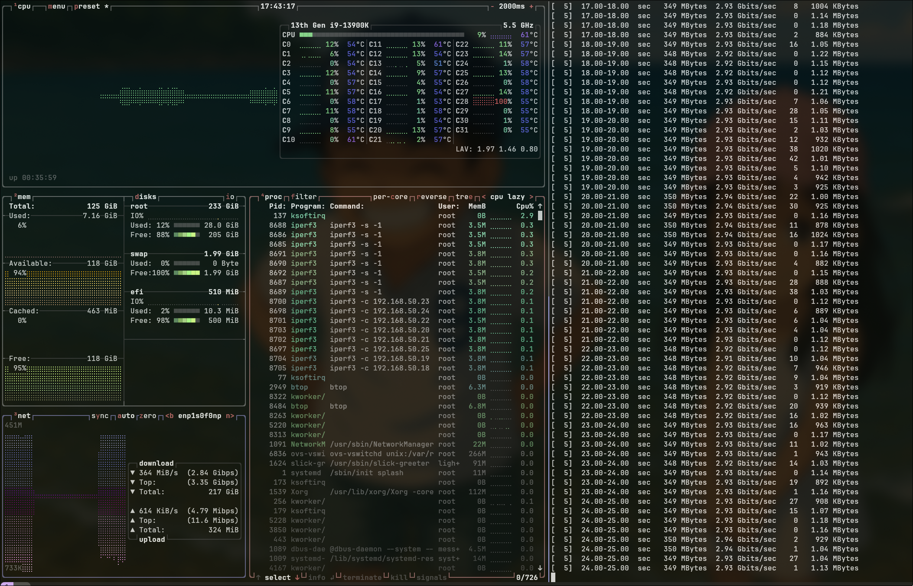

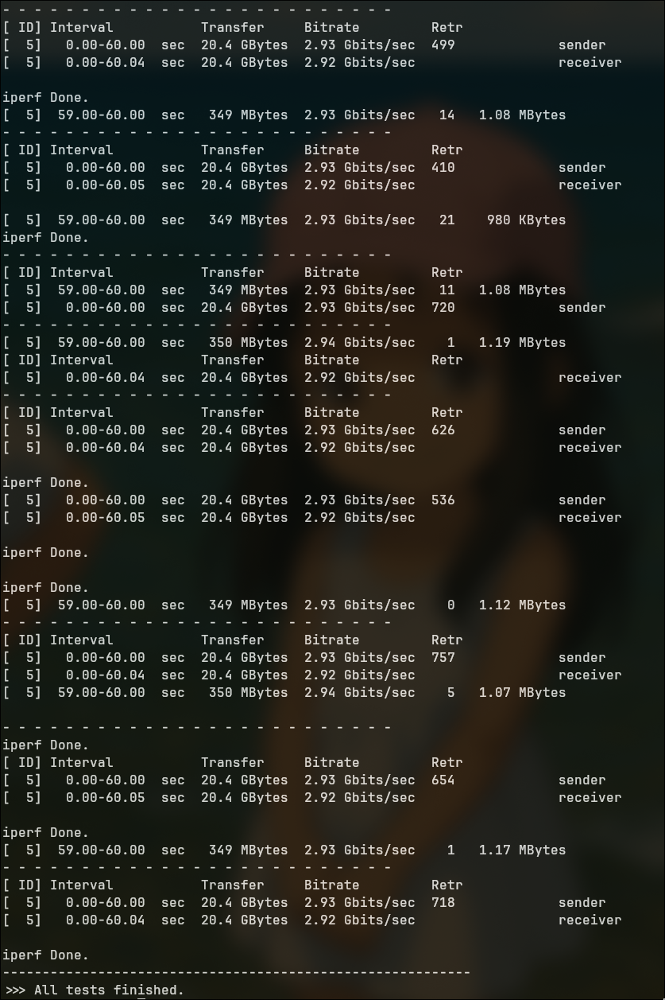

***NOTE: Today we tested with iperf and using 1 server and 1 client, and have a strange issue with Retransmissions without reason.***

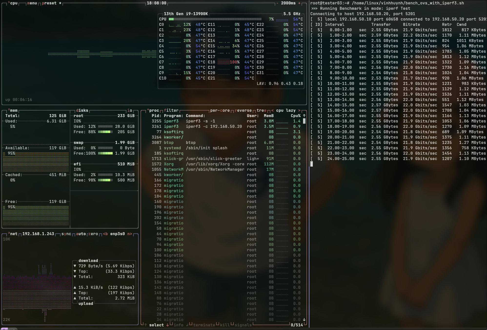

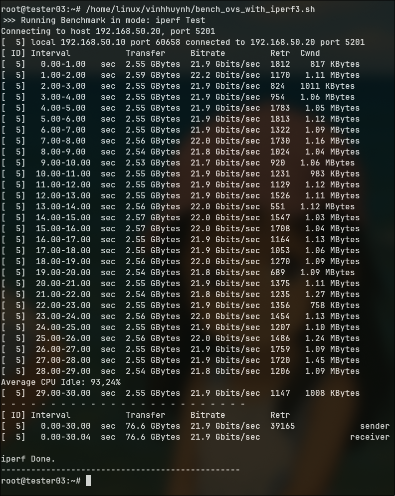

# 2026-01-22
## Work with Intel E810 Card

```yaml
Product Name: Intel Eth Network Adapter E810-CQDA2
Product Code: E810CQDA2G2P5
PBA Number: K91258-010
MAC Address: 6CFE5440C9C0
Manufacturing Date: Week 22 2022
```

```yaml
root@tester03:~# ethtool -i enp1s0f0np0 
driver: ice
version: 6.5.0-14-generic
firmware-version: 2.50 0x800077a6 1.2960.0
expansion-rom-version: 
bus-info: 0000:01:00.0
supports-statistics: yes
supports-test: yes
supports-eeprom-access: yes
supports-register-dump: yes
supports-priv-flags: yes
```

### 2 VFs on Tester03

#### Cable Connection - Loopback on Port 0 of E810

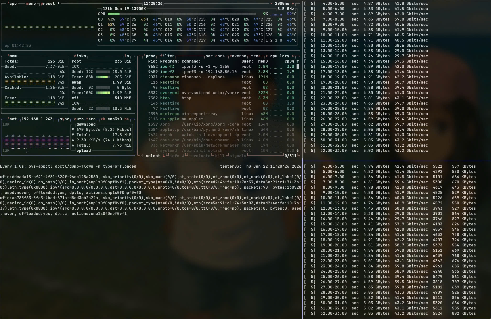

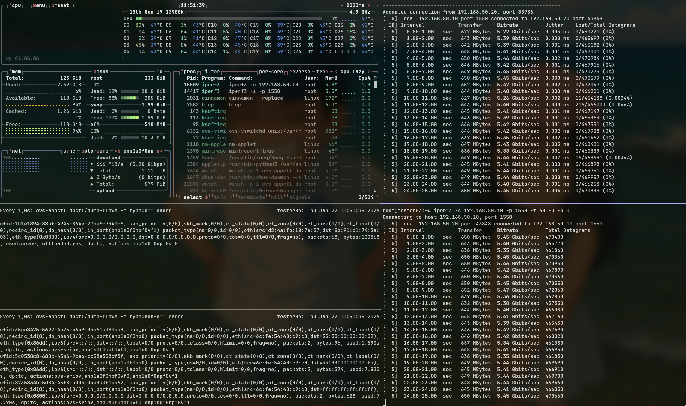

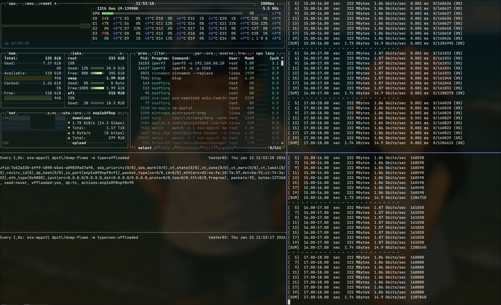

### 16 VFs on tester03

#### Cable Connection - Port 0 <-> Port 1 of E810 - All VFs are configured on PF0

##### ovs hw-offload=true

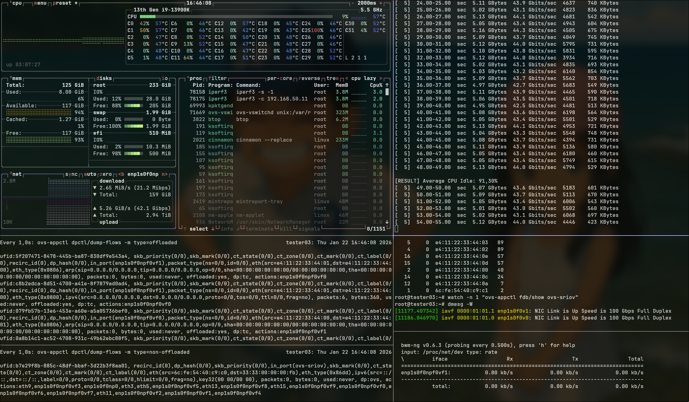

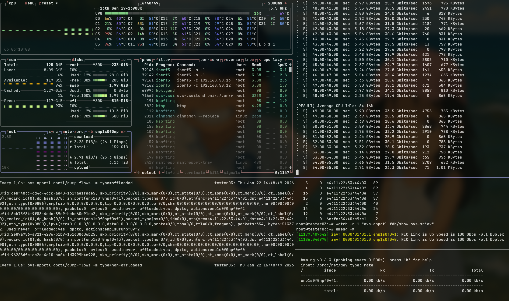

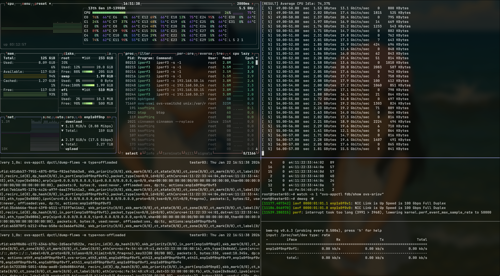

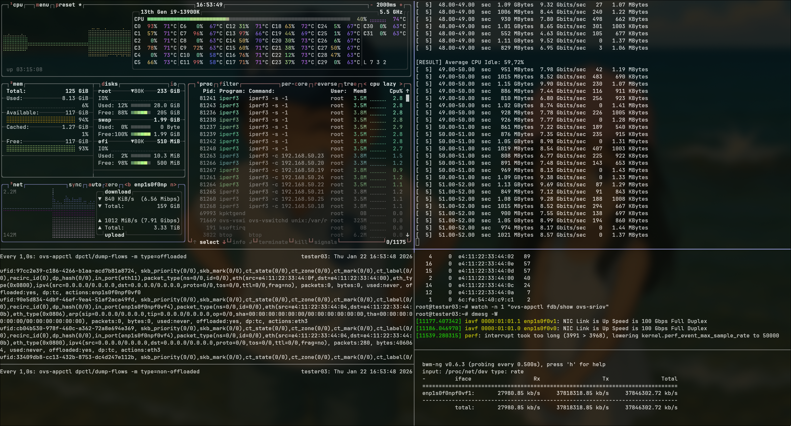

##### ovs hw-offload=false

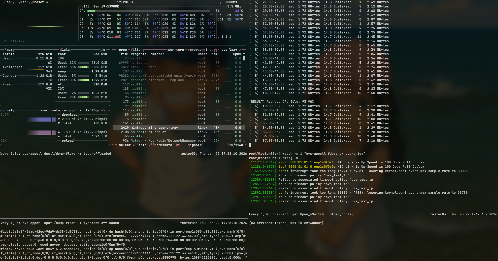
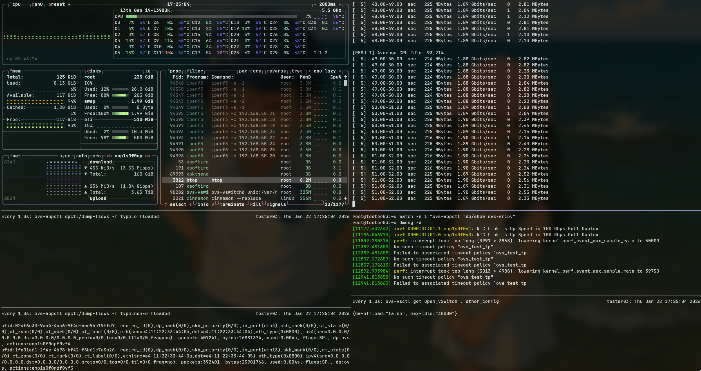

### Summary of Results - Intel E810
| Number of VFs | Traffic Type           | Performance      | Retransmissions | Average CPU Idle  | hw-offload |
|---------------|------------------------|-----------------|-----------------|-------------------|------------|
| 2 VFs         | TCP (Default)          | 14.8 Gbps    | 335           | 93.90%               | OFF         |
| 2 VFs         | TCP (Default)          | 39.3 Gbps    | 221445           | 91.90%               | ON          |
| 4 VFs         | TCP (Default)          | 7.44 Gbps   | 321          | 93.87%               | OFF         |
| 4 VFs         | TCP (Default)          | 29.3 Gbps    | 281481           | 83.20%               | ON          |
| 8 VFs         | TCP (Default)          | 3.78 Gbps    | 1296          | 93.64%               | OFF         |
| 8 VFs         | TCP (Default)          | 17.7 Gbps    | 165713           | 72.89%               | ON          |
| 16 VFs        | TCP (Default)          | 1.89 Gbps    | 882          | 93.15%               | OFF         |
| 16 VFs        | TCP (Default)          | 8.32 Gbps    | 43739           | 62.87%               | ON          |

# 2026-01-23

## Continue Testing Intel E810 with OVS

#### Cable Connection - Port 0 <-> Port 1 of E810 - All VFs are configured on PF0
##### Using pktgen to generate traffic with 2 VFs

```yaml
root@tester03:/proc/net/pktgen# /home/linux/vinhhuynh/bench_ovs_with_pktgen.sh
>>> Debug: Checking interfaces...
In ns0:
18: enp1s0f0v0: <BROADCAST,MULTICAST,UP,LOWER_UP> mtu 1500 qdisc mq state UP mode DEFAULT group default qlen 1000
    link/ether e4:11:22:33:44:00 brd ff:ff:ff:ff:ff:ff
In ns1:
1: lo: <LOOPBACK,UP,LOWER_UP> mtu 65536 qdisc noqueue state UNKNOWN mode DEFAULT group default qlen 1000
    link/loopback 00:00:00:00:00:00 brd 00:00:00:00:00:00
38: enp1s0f0v1: <BROADCAST,MULTICAST,UP,LOWER_UP> mtu 1500 qdisc mq state UP mode DEFAULT group default qlen 1000
    link/ether e4:11:22:33:44:01 brd ff:ff:ff:ff:ff:ff
>>> Setup Details:
    Source Interface: enp1s0f0v0 (in ns0)
    Target MAC:       e4:11:22:33:44:01 (in ns1)
------------------------------------------------
 >>> Testing with Hardware Offload ENABLED...
 Current OVS other_config:
{hw-offload="true", max-idle="30000"}
>>> Starting Test: HW OFFLOAD ON (dp:tc)
    Binding enp1s0f0v0 to pktgen thread...
    Configuring pktgen parameters...
    Current pktgen configuration:
Params: count 0  min_pkt_size: 1500  max_pkt_size: 1500
     src_mac: e4:11:22:33:44:00 dst_mac: e4:11:22:33:44:01
     src_mac_count: 0  dst_mac_count: 0
     cur_udp_dst: 0  cur_udp_src: 0
    Starting traffic for 20 seconds...
>>> Traffic is flowing. Waiting for 20 seconds...
Average CPU Idle: 94,45%
    Stopping traffic...
>>> Statistics for HW OFFLOAD ON (dp:tc):
     pkts-sofar: 196574759  errors: 0
Result: OK: 19924989(c19922954+d2035) usec, 196574759 (1500byte,0frags)
  9865739pps 118388Mb/sec (118388868000bps) errors: 0
------------------------------------------------
 >>> Testing with Hardware Offload DISABLED...
 Current OVS other_config:
{hw-offload="false", max-idle="30000"}
>>> Starting Test: HW OFFLOAD OFF (dp:ovs)
    Binding enp1s0f0v0 to pktgen thread...
    Configuring pktgen parameters...
    Current pktgen configuration:
Params: count 0  min_pkt_size: 1500  max_pkt_size: 1500
     src_mac: e4:11:22:33:44:00 dst_mac: e4:11:22:33:44:01
     src_mac_count: 0  dst_mac_count: 0
     cur_udp_dst: 0  cur_udp_src: 0
    Starting traffic for 20 seconds...
>>> Traffic is flowing. Waiting for 20 seconds...
Average CPU Idle: 94,33%
    Stopping traffic...
>>> Statistics for HW OFFLOAD OFF (dp:ovs):
     pkts-sofar: 179911858  errors: 0
Result: OK: 19946443(c19943155+d3288) usec, 179911858 (1500byte,0frags)
  9019746pps 108236Mb/sec (108236952000bps) errors: 0
------------------------------------------------
>>> Restoring Hardware Offload to ENABLED...
>>> Benchmark Complete. HW Offload restored to ON.
```

- This is pktgen's configuration on vs0 that run pktgen successfully with OVS hw-offload=true/false
```yaml
root@tester03:~# ip netns exec ns0 bash -c "cat /proc/net/pktgen/enp1s0f0v0"
Params: count 0  min_pkt_size: 1500  max_pkt_size: 1500
     frags: 0  delay: 0  clone_skb: 1000  ifname: enp1s0f0v0
     flows: 0 flowlen: 0
     queue_map_min: 0  queue_map_max: 0
     dst_min: 192.168.50.13  dst_max:
     src_min:   src_max:
     src_mac: e4:11:22:33:44:00 dst_mac: e4:11:22:33:44:03
     udp_src_min: 9  udp_src_max: 9  udp_dst_min: 9  udp_dst_max: 9
     src_mac_count: 0  dst_mac_count: 0
     burst: 32
     Flags: 
Current:
     pkts-sofar: 651047111  errors: 0
     started: 5643316132us  stopped: 5709155149us idle: 4696us
     seq_num: 651047112  cur_dst_mac_offset: 0  cur_src_mac_offset: 0
     cur_saddr: 192.168.50.10  cur_daddr: 192.168.50.13 
     cur_udp_dst: 9  cur_udp_src: 9
     cur_queue_map: 0
     flows: 0
Result: OK: 65839017(c65834321+d4696) usec, 651047111 (1500byte,0frags)
  9888469pps 118661Mb/sec (118661628000bps) errors: 0
```

# 2026-01-26
## Continue Testing Intel E810 with OVS - pktgen with 8 VFs
#### Cable Connection - Port 0 <-> Port 1 of E810 - All VFs are configured on PF0
##### Using pktgen to generate traffic with 16 VFs

| Number of VFs | Offload Feature | Performance      | Bandwidth | Average CPU Idle  |
|---------------|-----------------|-----------------|-------------------|--------------|
| 16 VFs         | {hw-offload="true", max-idle="30000", tc-policy=skip_sw} | 18395 Mbps    | |67.12%               |
| | | 14906 Mbps | | |
| | | 13720 Mbps | 123201 Mbps | |
| | | 13280 Mbps | | |
| | | 13124 Mbps | | |
| | | 13566 Mbps | | |
| | | 14732 Mbps | | |
| | | 18478 Mbps | | |
| 16 VFs         | {hw-offload="false", max-idle="30000", tc-policy=skip_sw}|  20302 Mbps    | | 74.02%               |
| | | 16005 Mbps | | |
| | | 14803 Mbps | 129477 Mbps | |
| | | 14492 Mbps | | |
| | | 14462 Mbps | | |
| | | 14790 Mbps | | |
| | | 15798 Mbps | | |
| | | 18825 Mbps | | |


# 2026-02-10 (Special Thanks to An Nguyen to research and build the test plan)
## Continue Testing Intel E810 with OVS - netpert with 16 VFs
#### Cable Connection - Port 0 <-> Port 1 of E810 - All VFs are configured on PF0
##### 2 VFs - netpert - hw-offload=true

```yaml
root@tester03:/home/linux/vinhhuynh# ./bench_ovs_with_netperf_nvf.sh
>>> Preparation: Starting 1 Servers...
>>> Benchmark: Starting 1 Clients simultaneously...
-----------------------------------------------------------
Pairing: ns0 ->  (192.168.50.11)
MIGRATED TCP STREAM TEST from 0.0.0.0 (0.0.0.0) port 0 AF_INET to 192.168.50.11 () port 0 AF_INET : +/-2.500% @ 95% conf.  : demo
[RESULT] Average CPU Idle: 91,11%
Recv   Send    Send
Socket Socket  Message  Elapsed                                                                                               
Size   Size    Size     Time     Throughput                                                                                   
bytes  bytes   bytes    secs.    10^6bits/sec
131072  16384  16384    60.00    43464.32
----------------------------------------------------------- 
>>> Finished testing with 2 VFs (1 pairs).
>>> Cleaned up netservers.
```
##### 4 VFs - netpert - hw-offload=true

```yaml
root@tester03:/home/linux/vinhhuynh# ./bench_ovs_with_netperf_nvf.sh                                                          
>>> Preparation: Starting 2 Servers...                                                                                        
>>> Benchmark: Starting 2 Clients simultaneously...                                                                           
-----------------------------------------------------------                                                                   
Pairing: ns0 ->  (192.168.50.13)                                                                                              
Pairing: ns1 ->  (192.168.50.12)                                                                                              
MIGRATED TCP STREAM TEST from 0.0.0.0 (0.0.0.0) port 0 AF_INET to 192.168.50.13 () port 0 AF_INET : +/-2.500% @ 95% conf.  : demo
MIGRATED TCP STREAM TEST from 0.0.0.0 (0.0.0.0) port 0 AF_INET to 192.168.50.12 () port 0 AF_INET : +/-2.500% @ 95% conf.  : demo
                                                                                                                              
[RESULT] Average CPU Idle: 82,99%                                                                                             
!!! WARNING                                                                                                                   
!!! Desired confidence was not achieved within the specified iterations.                                                      
!!! This implies that there was variability in the test environment that                                                      
!!! must be investigated before going further.                                                                                
!!! Confidence intervals: Throughput      : 15.228%                                                                           
!!!                       Local CPU util  : 0.000%                                                                            
!!!                       Remote CPU util : 0.000%                                                                            
                                                                                                                              
Recv   Send    Send                                                                                                           
Socket Socket  Message  Elapsed                                                                                               
Size   Size    Size     Time     Throughput  
bytes  bytes   bytes    secs.    10^6bits/sec  

131072  16384  16384    60.00    29692.16   
!!! WARNING                                                    
!!! Desired confidence was not achieved within the specified iterations.
!!! This implies that there was variability in the test environment that
!!! must be investigated before going further.
!!! Confidence intervals: Throughput      : 9.063%
!!!                       Local CPU util  : 0.000%
!!!                       Remote CPU util : 0.000%

Recv   Send    Send                          
Socket Socket  Message  Elapsed              
Size   Size    Size     Time     Throughput  
bytes  bytes   bytes    secs.    10^6bits/sec  

131072  16384  16384    60.00    28836.30   
-----------------------------------------------------------
>>> Finished testing with 4 VFs (2 pairs).
>>> Cleaned up netservers.
```

##### 8 VFs - netpert - hw-offload=true

```yaml
root@tester03:/home/linux/vinhhuynh# ./bench_ovs_with_netperf_nvf.sh 
>>> Preparation: Starting 4 Servers...
>>> Benchmark: Starting 4 Clients simultaneously...
-----------------------------------------------------------
Pairing: ns0 ->  (192.168.50.17)
Pairing: ns1 ->  (192.168.50.16)
Pairing: ns2 ->  (192.168.50.15)
Pairing: ns3 ->  (192.168.50.14)
MIGRATED TCP STREAM TEST from 0.0.0.0 (0.0.0.0) port 0 AF_INET to 192.168.50.17 () port 0 AF_INET : +/-2.500% @ 95% conf.  : demo
MIGRATED TCP STREAM TEST from 0.0.0.0 (0.0.0.0) port 0 AF_INET to 192.168.50.16 () port 0 AF_INET : +/-2.500% @ 95% conf.  : demo
MIGRATED TCP STREAM TEST from 0.0.0.0 (0.0.0.0) port 0 AF_INET to 192.168.50.15 () port 0 AF_INET : +/-2.500% @ 95% conf.  : demo
MIGRATED TCP STREAM TEST from 0.0.0.0 (0.0.0.0) port 0 AF_INET to 192.168.50.14 () port 0 AF_INET : +/-2.500% @ 95% conf.  : demo

[RESULT] Average CPU Idle: 71,66%
!!! WARNING                                                    
!!! Desired confidence was not achieved within the specified iterations.
!!! This implies that there was variability in the test environment that
!!! must be investigated before going further.
!!! Confidence intervals: Throughput      : 8.455%
!!!                       Local CPU util  : 0.000%
!!!                       Remote CPU util : 0.000%

Recv   Send    Send                          
Socket Socket  Message  Elapsed              
Size   Size    Size     Time     Throughput  
bytes  bytes   bytes    secs.    10^6bits/sec  

131072  16384  16384    60.00    17447.69   
Recv   Send    Send                          
Socket Socket  Message  Elapsed              
Size   Size    Size     Time     Throughput  
bytes  bytes   bytes    secs.    10^6bits/sec  

131072  16384  16384    60.00    17540.22   
!!! WARNING                                                    
!!! Desired confidence was not achieved within the specified iterations.
!!! This implies that there was variability in the test environment that
!!! must be investigated before going further.
!!! Confidence intervals: Throughput      : 13.763%
!!!                       Local CPU util  : 0.000%
!!!                       Remote CPU util : 0.000%
Recv   Send    Send                          
Socket Socket  Message  Elapsed              
Size   Size    Size     Time     Throughput  
bytes  bytes   bytes    secs.    10^6bits/sec  

131072  16384  16384    60.00    16929.44   
!!! WARNING                                                    
!!! Desired confidence was not achieved within the specified iterations.
!!! This implies that there was variability in the test environment that
!!! must be investigated before going further.
!!! Confidence intervals: Throughput      : 6.835%
!!!                       Local CPU util  : 0.000%
!!!                       Remote CPU util : 0.000%

Recv   Send    Send                          
Socket Socket  Message  Elapsed              
Size   Size    Size     Time     Throughput  
bytes  bytes   bytes    secs.    10^6bits/sec  

131072  16384  16384    60.00    17321.80   
-----------------------------------------------------------
>>> Finished testing with 8 VFs (4 pairs).
>>> Cleaned up netservers.
```
##### 16 VFs - netpert - hw-offload=true

```yaml
root@tester03:/home/linux/vinhhuynh# ./bench_ovs_with_netperf_nvf.sh
>>> Preparation: Starting 8 Servers...
>>> Benchmark: Starting 8 Clients simultaneously...
-----------------------------------------------------------
Pairing: ns0 ->  (192.168.50.25)
Pairing: ns1 ->  (192.168.50.24)
Pairing: ns2 ->  (192.168.50.23)
Pairing: ns3 ->  (192.168.50.22)
Pairing: ns4 ->  (192.168.50.21)
Pairing: ns5 ->  (192.168.50.20)
Pairing: ns6 ->  (192.168.50.19)
Pairing: ns7 ->  (192.168.50.18)
MIGRATED TCP STREAM TEST from 0.0.0.0 (0.0.0.0) port 0 AF_INET to 192.168.50.25 () port 0 AF_INET : +/-2.500% @ 95% conf.  : demo
MIGRATED TCP STREAM TEST from 0.0.0.0 (0.0.0.0) port 0 AF_INET to 192.168.50.22 () port 0 AF_INET : +/-2.500% @ 95% conf.  : demo
MIGRATED TCP STREAM TEST from 0.0.0.0 (0.0.0.0) port 0 AF_INET to 192.168.50.24 () port 0 AF_INET : +/-2.500% @ 95% conf.  : demo
MIGRATED TCP STREAM TEST from 0.0.0.0 (0.0.0.0) port 0 AF_INET to 192.168.50.23 () port 0 AF_INET : +/-2.500% @ 95% conf.  : demo
MIGRATED TCP STREAM TEST from 0.0.0.0 (0.0.0.0) port 0 AF_INET to 192.168.50.18 () port 0 AF_INET : +/-2.500% @ 95% conf.  : demo
MIGRATED TCP STREAM TEST from 0.0.0.0 (0.0.0.0) port 0 AF_INET to 192.168.50.20 () port 0 AF_INET : +/-2.500% @ 95% conf.  : demo
MIGRATED TCP STREAM TEST from 0.0.0.0 (0.0.0.0) port 0 AF_INET to 192.168.50.21 () port 0 AF_INET : +/-2.500% @ 95% conf.  : demo
MIGRATED TCP STREAM TEST from 0.0.0.0 (0.0.0.0) port 0 AF_INET to 192.168.50.19 () port 0 AF_INET : +/-2.500% @ 95% conf.  : demo
[RESULT] Average CPU Idle: 66,87% 
Recv   Send    Send
Socket Socket  Message  Elapsed
Size   Size    Size     Time     Throughput
bytes  bytes   bytes    secs.    10^6bits/sec
131072  16384  16384    60.00    9197.90 
Recv   Send    Send
Socket Socket  Message  Elapsed 
Size   Size    Size     Time     Throughput
bytes  bytes   bytes    secs.    10^6bits/sec
131072  16384  16384    60.00    8906.98 
!!! WARNING
!!! Desired confidence was not achieved within the specified iterations.
!!! This implies that there was variability in the test environment that
!!! must be investigated before going further.
!!! Confidence intervals: Throughput      : 17.426%
!!!                       Local CPU util  : 0.000%
!!!                       Remote CPU util : 0.000%
Recv   Send    Send
Socket Socket  Message  Elapsed
Size   Size    Size     Time     Throughput
bytes  bytes   bytes    secs.    10^6bits/sec
131072  16384  16384    60.00    9969.81 
!!! WARNING
!!! Desired confidence was not achieved within the specified iterations.
!!! This implies that there was variability in the test environment that
!!! must be investigated before going further.
!!! Confidence intervals: Throughput      : 22.969%
!!!                       Local CPU util  : 0.000%
!!!                       Remote CPU util : 0.000%
Recv   Send    Send                          
Socket Socket  Message  Elapsed              
Size   Size    Size     Time     Throughput  
bytes  bytes   bytes    secs.    10^6bits/sec  

131072  16384  16384    60.00    10424.38   
!!! WARNING                                                    
!!! Desired confidence was not achieved within the specified iterations.
!!! This implies that there was variability in the test environment that
!!! must be investigated before going further.
!!! Confidence intervals: Throughput      : 19.820%
!!!                       Local CPU util  : 0.000%
!!!                       Remote CPU util : 0.000%

Recv   Send    Send                          
Socket Socket  Message  Elapsed              
Size   Size    Size     Time     Throughput  
bytes  bytes   bytes    secs.    10^6bits/sec  

131072  16384  16384    60.00    9665.40   
!!! WARNING                                                    
!!! Desired confidence was not achieved within the specified iterations.
!!! This implies that there was variability in the test environment that
!!! must be investigated before going further.
!!! Confidence intervals: Throughput      : 18.924%
!!!                       Local CPU util  : 0.000%
!!!                       Remote CPU util : 0.000%

Recv   Send    Send                          
Socket Socket  Message  Elapsed              
Size   Size    Size     Time     Throughput  
bytes  bytes   bytes    secs.    10^6bits/sec  

131072  16384  16384    60.00    9490.65   
!!! WARNING                                                    
!!! Desired confidence was not achieved within the specified iterations.
!!! This implies that there was variability in the test environment that
!!! must be investigated before going further.
!!! Confidence intervals: Throughput      : 21.452%
!!!                       Local CPU util  : 0.000%
!!!                       Remote CPU util : 0.000%

Recv   Send    Send                          
Socket Socket  Message  Elapsed              
Size   Size    Size     Time     Throughput  
bytes  bytes   bytes    secs.    10^6bits/sec  

131072  16384  16384    60.00    9532.74   
!!! WARNING                                                    
!!! Desired confidence was not achieved within the specified iterations.
!!! This implies that there was variability in the test environment that
!!! must be investigated before going further.
!!! Confidence intervals: Throughput      : 22.081%
!!!                       Local CPU util  : 0.000%
!!!                       Remote CPU util : 0.000%
Recv   Send    Send                          
Socket Socket  Message  Elapsed              
Size   Size    Size     Time     Throughput  
bytes  bytes   bytes    secs.    10^6bits/sec  

131072  16384  16384    60.00    9500.28   
-----------------------------------------------------------
>>> Finished testing with 16 VFs (8 pairs).
>>> Cleaned up netservers.
```

##### 2 VFs - netpert - hw-offload=false - skip_sw

```yaml
root@tester03:/home/linux/vinhhuynh# ./bench_ovs_with_netperf_nvf.sh 
>>> Preparation: Starting 1 Servers...
>>> Benchmark: Starting 1 Clients simultaneously...
-----------------------------------------------------------
Pairing: ns0 ->  (192.168.50.11)
MIGRATED TCP STREAM TEST from 0.0.0.0 (0.0.0.0) port 0 AF_INET to 192.168.50.11 () port 0 AF_INET : +/-2.500% @ 95% conf.  : demo

[RESULT] Average CPU Idle: 95,03%
Recv   Send    Send                          
Socket Socket  Message  Elapsed              
Size   Size    Size     Time     Throughput  
bytes  bytes   bytes    secs.    10^6bits/sec  

131072  16384  16384    60.00    9508.78   
-----------------------------------------------------------
>>> Finished testing with 2 VFs (1 pairs).
>>> Cleaned up netservers.
```
##### 4 VFs - netpert - hw-offload=false - skip_sw
```yaml
root@tester03:/home/linux/vinhhuynh# ./bench_ovs_with_netperf_nvf.sh                                                                                                                                                                                    
>>> Preparation: Starting 2 Servers...
>>> Benchmark: Starting 2 Clients simultaneously...
-----------------------------------------------------------
Pairing: ns0 ->  (192.168.50.13)
Pairing: ns1 ->  (192.168.50.12)
MIGRATED TCP STREAM TEST from 0.0.0.0 (0.0.0.0) port 0 AF_INET to 192.168.50.12 () port 0 AF_INET : +/-2.500% @ 95% conf.  : demo
MIGRATED TCP STREAM TEST from 0.0.0.0 (0.0.0.0) port 0 AF_INET to 192.168.50.13 () port 0 AF_INET : +/-2.500% @ 95% conf.  : demo

[RESULT] Average CPU Idle: 95,08%
Recv   Send    Send                          
Socket Socket  Message  Elapsed              
Size   Size    Size     Time     Throughput  
bytes  bytes   bytes    secs.    10^6bits/sec  

131072  16384  16384    60.01    4748.17   
Recv   Send    Send                          
Socket Socket  Message  Elapsed              
Size   Size    Size     Time     Throughput  
bytes  bytes   bytes    secs.    10^6bits/sec  

131072  16384  16384    60.01    4748.17   
-----------------------------------------------------------
>>> Finished testing with 4 VFs (2 pairs).
>>> Cleaned up netservers.
```
##### 8 VFs - netpert - hw-offload=false - skip_sw
```yaml
root@tester03:/home/linux/vinhhuynh# ./bench_ovs_with_netperf_nvf.sh                                                                                                                                                                                    
>>> Preparation: Starting 4 Servers...
>>> Benchmark: Starting 4 Clients simultaneously...
-----------------------------------------------------------
Pairing: ns0 ->  (192.168.50.17)
Pairing: ns1 ->  (192.168.50.16)
Pairing: ns2 ->  (192.168.50.15)
Pairing: ns3 ->  (192.168.50.14)
MIGRATED TCP STREAM TEST from 0.0.0.0 (0.0.0.0) port 0 AF_INET to 192.168.50.16 () port 0 AF_INET : +/-2.500% @ 95% conf.  : demo
MIGRATED TCP STREAM TEST from 0.0.0.0 (0.0.0.0) port 0 AF_INET to 192.168.50.17 () port 0 AF_INET : +/-2.500% @ 95% conf.  : demo
MIGRATED TCP STREAM TEST from 0.0.0.0 (0.0.0.0) port 0 AF_INET to 192.168.50.15 () port 0 AF_INET : +/-2.500% @ 95% conf.  : demo
MIGRATED TCP STREAM TEST from 0.0.0.0 (0.0.0.0) port 0 AF_INET to 192.168.50.14 () port 0 AF_INET : +/-2.500% @ 95% conf.  : demo

[RESULT] Average CPU Idle: 94,84%
Recv   Send    Send                          
Socket Socket  Message  Elapsed              
Size   Size    Size     Time     Throughput  
bytes  bytes   bytes    secs.    10^6bits/sec  

131072  16384  16384    60.01    2410.61   
Recv   Send    Send                          
Socket Socket  Message  Elapsed              
Size   Size    Size     Time     Throughput  
Recv   Send    Send                          
Socket Socket  Message  Elapsed              
Size   Size    Size     Time     Throughput  
bytes  bytes   bytes    secs.    10^6bits/sec  

bytes  bytes   bytes    secs.    10^6bits/sec  

131072  16384  16384    60.01    2410.64   
131072  16384  16384    60.01    2410.52   
Recv   Send    Send                          
Socket Socket  Message  Elapsed              
Size   Size    Size     Time     Throughput  
bytes  bytes   bytes    secs.    10^6bits/sec  

131072  16384  16384    60.01    2410.62   
-----------------------------------------------------------
>>> Finished testing with 8 VFs (4 pairs).
>>> Cleaned up netservers.
```

##### 16 VFs - netpert - hw-offload=false - skip_sw

```yaml
root@tester03:/home/linux/vinhhuynh# ./bench_ovs_with_netperf_nvf.sh 
>>> Preparation: Starting 8 Servers...
>>> Benchmark: Starting 8 Clients simultaneously...
-----------------------------------------------------------
Pairing: ns0 ->  (192.168.50.25)
Pairing: ns1 ->  (192.168.50.24)
Pairing: ns2 ->  (192.168.50.23)
Pairing: ns3 ->  (192.168.50.22)
Pairing: ns4 ->  (192.168.50.21)
Pairing: ns5 ->  (192.168.50.20)
Pairing: ns6 ->  (192.168.50.19)
Pairing: ns7 ->  (192.168.50.18)
MIGRATED TCP STREAM TEST from 0.0.0.0 (0.0.0.0) port 0 AF_INET to 192.168.50.25 () port 0 AF_INET : +/-2.500% @ 95% conf.  : demo
MIGRATED TCP STREAM TEST from 0.0.0.0 (0.0.0.0) port 0 AF_INET to 192.168.50.24 () port 0 AF_INET : +/-2.500% @ 95% conf.  : demo
MIGRATED TCP STREAM TEST from 0.0.0.0 (0.0.0.0) port 0 AF_INET to 192.168.50.22 () port 0 AF_INET : +/-2.500% @ 95% conf.  : demo
MIGRATED TCP STREAM TEST from 0.0.0.0 (0.0.0.0) port 0 AF_INET to 192.168.50.23 () port 0 AF_INET : +/-2.500% @ 95% conf.  : demo
MIGRATED TCP STREAM TEST from 0.0.0.0 (0.0.0.0) port 0 AF_INET to 192.168.50.21 () port 0 AF_INET : +/-2.500% @ 95% conf.  : demo
MIGRATED TCP STREAM TEST from 0.0.0.0 (0.0.0.0) port 0 AF_INET to 192.168.50.19 () port 0 AF_INET : +/-2.500% @ 95% conf.  : demo
MIGRATED TCP STREAM TEST from 0.0.0.0 (0.0.0.0) port 0 AF_INET to 192.168.50.18 () port 0 AF_INET : +/-2.500% @ 95% conf.  : demo
MIGRATED TCP STREAM TEST from 0.0.0.0 (0.0.0.0) port 0 AF_INET to 192.168.50.20 () port 0 AF_INET : +/-2.500% @ 95% conf.  : demo

[RESULT] Average CPU Idle: 93,35%
Recv   Send    Send                          
Socket Socket  Message  Elapsed              
Size   Size    Size     Time     Throughput  
bytes  bytes   bytes    secs.    10^6bits/sec  

131072  16384  16384    60.01    1890.81   
Recv   Send    Send                          
Socket Socket  Message  Elapsed              
Size   Size    Size     Time     Throughput  
bytes  bytes   bytes    secs.    10^6bits/sec  

131072  16384  16384    60.01    1890.79   
Recv   Send    Send                          
Socket Socket  Message  Elapsed              
Size   Size    Size     Time     Throughput  
bytes  bytes   bytes    secs.    10^6bits/sec  

131072  16384  16384    60.01    1890.78   
Recv   Send    Send                          
Socket Socket  Message  Elapsed              
Size   Size    Size     Time     Throughput  
bytes  bytes   bytes    secs.    10^6bits/sec  

131072  16384  16384    60.01    1890.81   
Recv   Send    Send                          
Socket Socket  Message  Elapsed              
Size   Size    Size     Time     Throughput  
bytes  bytes   bytes    secs.    10^6bits/sec  

131072  16384  16384    60.01    1890.83   
Recv   Send    Send                          
Socket Socket  Message  Elapsed              
Size   Size    Size     Time     Throughput  
bytes  bytes   bytes    secs.    10^6bits/sec  

131072  16384  16384    60.01    1890.84
Recv   Send    Send                          
Socket Socket  Message  Elapsed              
Size   Size    Size     Time     Throughput  
bytes  bytes   bytes    secs.    10^6bits/sec  

131072  16384  16384    60.01    1890.84   
Recv   Send    Send                          
Socket Socket  Message  Elapsed              
Size   Size    Size     Time     Throughput  
bytes  bytes   bytes    secs.    10^6bits/sec  

131072  16384  16384    60.01    1891.00   
-----------------------------------------------------------
>>> Finished testing with 16 VFs (8 pairs).
>>> Cleaned up netservers.
```

##### Performance Comparison Summary

| VF Count (Pairs) | HW-Offload | Total Throughput (Gbps) | Avg. Throughput per VF (Gbps) | Avg. CPU Idle | Stability (Warnings) |
|------------------|------------|-------------------------|-------------------------------|---------------|----------------------|
|2 VF (1 pair) | ON (true) | 43.46 | 43.46 | 91.11% | Stable (No warnings)|
| |OFF (false)   | 9.51      | 9.51  | 95.03%| Stable |
|4 VF (2 pairs)|ON (true)|~58.53|~29.26|82.99%|Unstable (Warnings present)|
| |OFF (false)|~9.50|~4.75|95.08%|Stable|
|8 VF (4 pairs)|ON (true)|~69.24|~17.31|71.66%|Unstable (Warnings present)|
| | OFF (false)|~9.64|~2.41|94.84%|Stable|
|16 VF (8 pairs)|ON (true)|~77.69|~9.71|66.87%|Unstable (Warnings present)|
| |OFF (false)|~15.13|~1.89|93.35%|Stable|


# 2026-02-26 
## Continue Testing Intel E810 with OVS - iperf3/netpert with 2 VFs using linux-containers (lxc)
### Setup
- Using linux container (lxc) to create 2 containers (lxc-pc1 and lxc-pc2) to run netperf server and client respectively
- Each container is configured with 1 VF and connected to OVS bridge (br0) with hw-offload ENABLED
```bash
# Install lxc and create linux-containers
sudo apt-get install -y lxc
sudo lxc-create -n lxc-pc1 -t download -- -d ubuntu -r jammy -a amd64
sudo lxc-create -n lxc-pc2 -t download -- -d ubuntu -r jammy -a amd64
# Configure network interfaces for each container and connect to OVS bridge
sudo nvim /var/lib/lxc/lxc-pc1/config
sudo nvim /var/lib/lxc/lxc-pc2/config
# Start the containers
sudo lxc-start -n lxc-pc1
sudo lxc-start -n lxc-pc2
# Attach to each container and install netperf
sudo lxc-attach -n lxc-pc1 -- apt-get update && apt-get install -y netperf iperf3
sudo lxc-attach -n lxc-pc2 -- apt-get update && apt-get install -y netperf iperf3
```
config file for lxc-pc1
```ini
# Network configuration for lxc-pc1
# Template used to create this container: /usr/share/lxc/templates/lxc-download
# Parameters passed to the template: -d ubuntu -r jammy -a amd64
# For additional config options, please look at lxc.container.conf(5)

# Uncomment the following line to support nesting containers:
#lxc.include = /usr/share/lxc/config/nesting.conf
# (Be aware this has security implications)


# Distribution configuration
lxc.include = /usr/share/lxc/config/common.conf
lxc.arch = linux64

# Container specific configuration
lxc.rootfs.path = dir:/var/lib/lxc/lxc-pc1/rootfs
lxc.uts.name = lxc-pc1

# Network configuration
# lxc.net.0.type = veth
# lxc.net.0.link = lxcbr0
# lxc.net.0.flags = up
# lxc.net.0.hwaddr = 00:16:3e:d5:e2:6d

# VF passthrough
lxc.net.0.type = phys
lxc.net.0.link = enp1s0f0v0
lxc.net.0.name = eth0
lxc.net.0.flags = up
```

config file for lxc-pc2
```ini
# Network configuration for lxc-pc2
# Template used to create this container: /usr/share/lxc/templates/lxc-download
# Parameters passed to the template: -d ubuntu -r jammy -a amd64
# For additional config options, please look at lxc.container.conf(5)

# Uncomment the following line to support nesting containers:
#lxc.include = /usr/share/lxc/config/nesting.conf
# (Be aware this has security implications)


# Distribution configuration
lxc.include = /usr/share/lxc/config/common.conf
lxc.arch = linux64

# Container specific configuration
lxc.rootfs.path = dir:/var/lib/lxc/lxc-pc2/rootfs
lxc.uts.name = lxc-pc2

# Network configuration
# lxc.net.0.type = veth
# lxc.net.0.link = lxcbr0
# lxc.net.0.flags = up
# lxc.net.0.hwaddr = 00:16:3e:db:ec:7a

# VF passthrough
lxc.net.0.type = phys
lxc.net.0.link = enp1s0f0v1
lxc.net.0.name = eth0
lxc.net.0.flags = up
```
### Test Results
- With hw-offload enabled, the iperf test between lxc-pc1 and lxc-pc2
```yaml
root@lxc-pc2:~# iperf3 -c 10.10.10.1 -t 30
Connecting to host 10.10.10.1, port 5201
[  5] local 10.10.10.2 port 34954 connected to 10.10.10.1 port 5201
[ ID] Interval           Transfer     Bitrate         Retr  Cwnd
[  5]   0.00-1.00   sec  4.88 GBytes  41.9 Gbits/sec  3509    936 KBytes       
[  5]   1.00-2.00   sec  4.89 GBytes  42.0 Gbits/sec  5686    776 KBytes       
[  5]   2.00-3.00   sec  4.95 GBytes  42.5 Gbits/sec  4798    663 KBytes       
[  5]   3.00-4.00   sec  5.05 GBytes  43.4 Gbits/sec  5907    858 KBytes       
[  5]   4.00-5.00   sec  5.10 GBytes  43.8 Gbits/sec  4975    730 KBytes       
[  5]   5.00-6.00   sec  4.95 GBytes  42.5 Gbits/sec  4754    748 KBytes       
[  5]   6.00-7.00   sec  4.89 GBytes  42.0 Gbits/sec  4559    574 KBytes       
[  5]   7.00-8.00   sec  4.86 GBytes  41.8 Gbits/sec  3614    530 KBytes       
[  5]   8.00-9.00   sec  4.89 GBytes  42.0 Gbits/sec  3475    915 KBytes       
[  5]   9.00-10.00  sec  4.90 GBytes  42.1 Gbits/sec  3435    943 KBytes       
[  5]  10.00-11.00  sec  4.89 GBytes  42.0 Gbits/sec  4702    922 KBytes       
[  5]  11.00-12.00  sec  4.88 GBytes  41.9 Gbits/sec  5432    577 KBytes       
[  5]  12.00-13.00  sec  4.87 GBytes  41.8 Gbits/sec  4335    991 KBytes       
[  5]  13.00-14.00  sec  4.92 GBytes  42.2 Gbits/sec  4630    529 KBytes       
[  5]  14.00-15.00  sec  5.29 GBytes  45.5 Gbits/sec  4598    766 KBytes       
[  5]  15.00-16.00  sec  5.16 GBytes  44.3 Gbits/sec  5420    677 KBytes       
[  5]  16.00-17.00  sec  4.84 GBytes  41.6 Gbits/sec  4919    564 KBytes       
[  5]  17.00-18.00  sec  4.84 GBytes  41.6 Gbits/sec  6270    592 KBytes       
[  5]  18.00-19.00  sec  5.00 GBytes  43.0 Gbits/sec  4709    735 KBytes       
[  5]  19.00-20.00  sec  5.27 GBytes  45.3 Gbits/sec  5775    571 KBytes       
[  5]  20.00-21.00  sec  4.89 GBytes  42.0 Gbits/sec  5055    687 KBytes       
[  5]  21.00-22.00  sec  4.85 GBytes  41.6 Gbits/sec  5166    758 KBytes       
[  5]  22.00-23.00  sec  4.85 GBytes  41.7 Gbits/sec  4565    823 KBytes       
[  5]  23.00-24.00  sec  4.85 GBytes  41.7 Gbits/sec  5166    922 KBytes       
[  5]  24.00-25.00  sec  4.79 GBytes  41.1 Gbits/sec  4564    536 KBytes       
[  5]  25.00-26.00  sec  4.55 GBytes  39.1 Gbits/sec  3396    872 KBytes       
[  5]  26.00-27.00  sec  4.53 GBytes  38.9 Gbits/sec  2786    535 KBytes       
[  5]  27.00-28.00  sec  4.79 GBytes  41.1 Gbits/sec  4182    584 KBytes       
[  5]  28.00-29.00  sec  4.65 GBytes  39.9 Gbits/sec  4302    601 KBytes       
[  5]  29.00-30.00  sec  4.86 GBytes  41.7 Gbits/sec  4535    949 KBytes       
- - - - - - - - - - - - - - - - - - - - - - - - -
[ ID] Interval           Transfer     Bitrate         Retr
[  5]   0.00-30.00  sec   147 GBytes  42.1 Gbits/sec  139219             sender
[  5]   0.00-30.04  sec   147 GBytes  42.0 Gbits/sec                  receiver
```

- With hw-offload enabled, the netperf test between lxc-pc1 and lxc-pc2
```yaml
netperf -H 10.10.10.1 -t TCP_STREAM -l 30
MIGRATED TCP STREAM TEST from 0.0.0.0 (0.0.0.0) port 0 AF_INET to 10.10.10.1 () port 0 AF_INET : demo
Recv   Send    Send                          
Socket Socket  Message  Elapsed              
Size   Size    Size     Time     Throughput  
bytes  bytes   bytes    secs.    10^6bits/sec  

131072  16384  16384    30.00    43562.92
```


